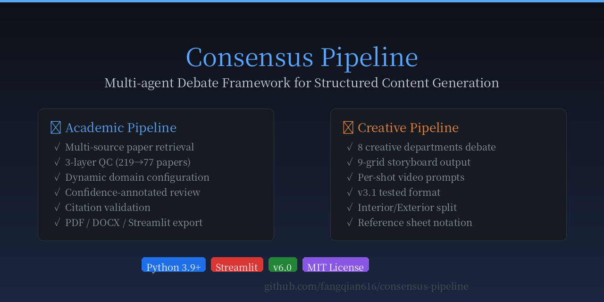
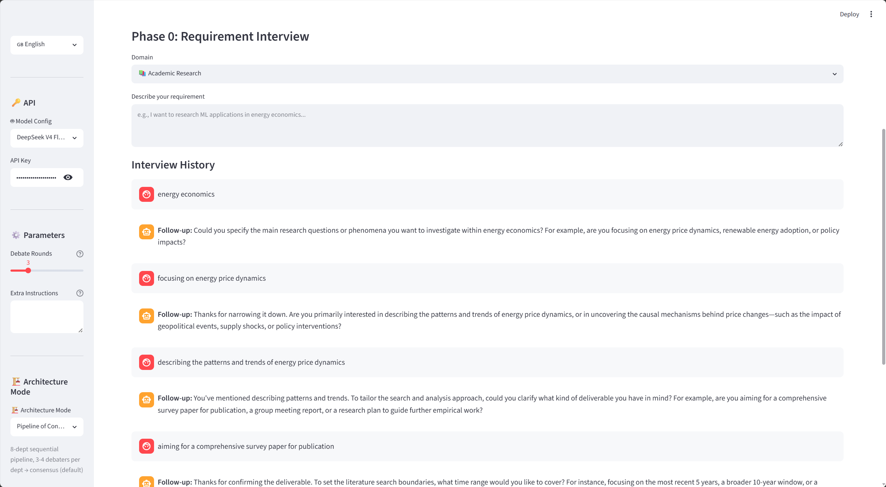
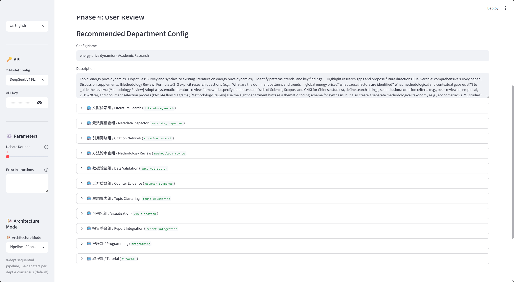
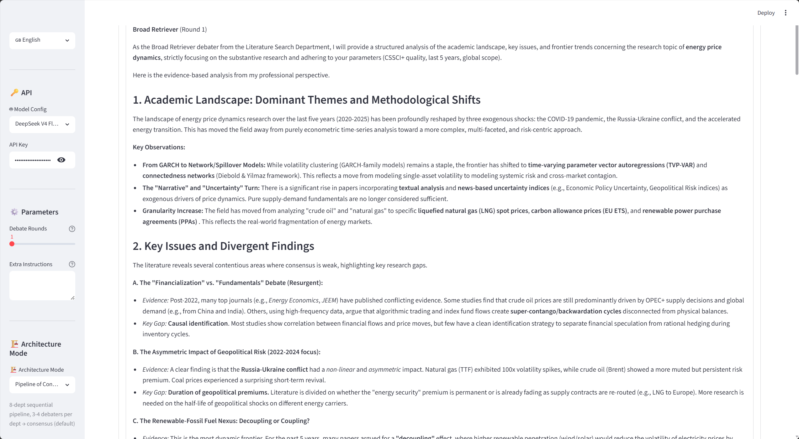
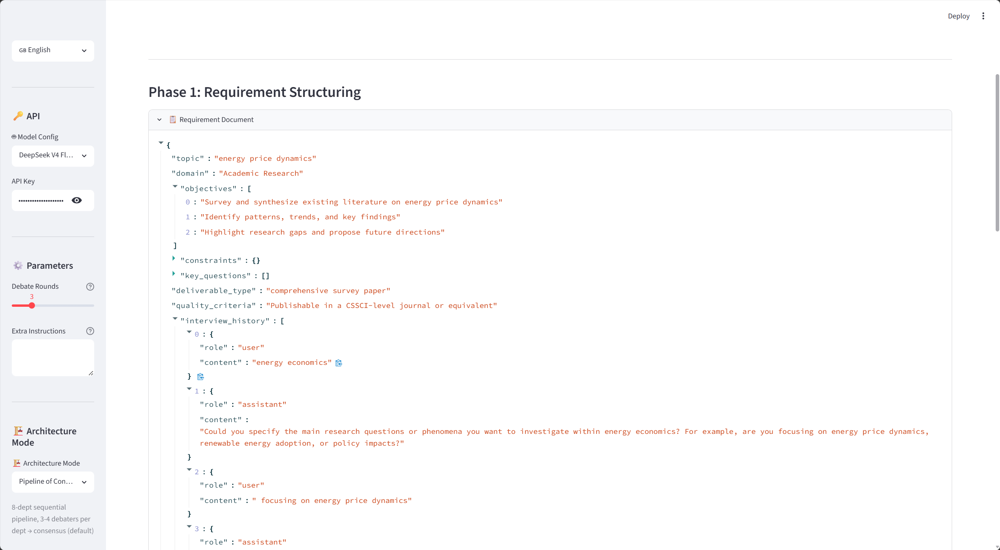
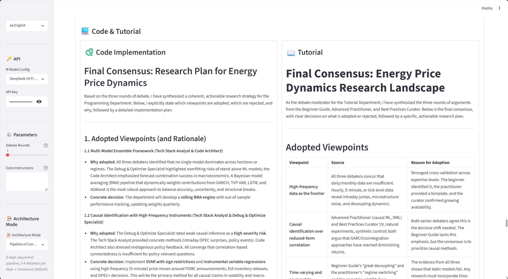
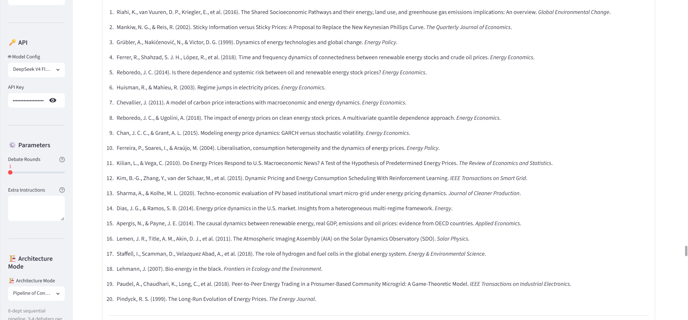

# 🧠 Consensus Pipeline

<p align="center">
  
</p>

<p align="center">
  
  
  
  
</p>

> **Multi-agent debate framework for academic research.**
> Instead of one AI writing a literature review for you — an AI team interviews you, debates each claim, and reaches consensus with per-claim confidence scores.

📖 [中文文档](README_CN.md) · 📦 [GitHub Releases](https://github.com/fangqian616/consensus-pipeline/releases)

---

## ❓ Why Not Just Ask ChatGPT?

A single LLM produces confident-sounding answers with no cross-validation — hallucinations slip through, conflicting perspectives get flattened, and you can't tell which conclusions are solid vs. speculative.

Consensus Pipeline replaces one-shot generation with **structured multi-agent debate as a quality gate**: every claim is challenged by independent "departments," contradictions are surfaced explicitly, and final conclusions carry **confidence annotations** (e.g., "42/77 papers, high confidence").

Think of it as built-in peer review — not a single author, but an adversarial committee.

---

## 📸 What It Looks Like

### Step 1: Requirement Interview
The pipeline starts by interviewing you — an AI agent asks clarifying questions to understand your research scope, constraints, and goals.



### Step 2: Smart Department Configuration
Based on your topic, the AI auto-generates 10+ specialized debate departments with multiple debaters per department. Each debater argues from a different methodological perspective.



### Step 3: Multi-Round Debate
Watch debaters argue in real-time. Each round, debaters present their position, challenge others' assumptions, and refine their arguments. The pipeline runs 2-3 rounds per department before reaching consensus.



### Step 4: Structured Output
Debate results are structured into JSON with clear roles, positions, and consensus points — ready for report generation.



### Step 5: Report with Confidence Annotations
The final report includes per-claim confidence scores, methodology comparison matrices, and verified citations. Every conclusion tells you how many papers support it.

Full example report (148 papers, energy economics): see `examples/final_report.md`

### Bonus: Auto-Generated Code & References
The pipeline also generates runnable Python code for key methods and compiles a verified reference list.

<p float="left">
  
  
</p>

---

## 🎯 What It Does

Consensus Pipeline takes a research topic and produces a structured literature review through multi-agent debate.

**The pipeline in one sentence:** Search papers → 3-layer QC filter → 10 departments debate each claim → cross-department validation → generate report with confidence scores.

**Key difference from tools like Elicit/Consensus:** Those tools extract and summarize. This tool *debates*. Each finding has to survive adversarial challenge from multiple AI agents before it makes it into the report.

### What actually works (v0.7.5):
- ✅ Multi-source paper search (OpenAlex + Semantic Scholar + arXiv)
- ✅ 3-layer QC: hard filter → LLM classify → importance tagging (219 → 77 papers, ~65% exclusion)
- ✅ 10-11 debate departments, each with 2-4 debaters arguing from different perspectives
- ✅ Multi-round debate (2-3 rounds per department)
- ✅ Cross-department validation (one department checks another's work)
- ✅ Per-claim confidence annotation (e.g., "42/77 papers, high confidence")
- ✅ Citation validation (auto-verify all `[N]` references)
- ✅ Auto-generated runnable code for research methods
- ✅ PDF/DOCX export
- ✅ Bilingual output (`--lang en` or `--lang zh`)
- ✅ Streamlit UI with real-time debate monitoring

### What's still rough:
- ⚠️ Some UI labels are bilingual (Chinese/English mix) in English mode
- ⚠️ Final report language can leak (English mode occasionally outputs Chinese sections)
- ⚠️ No GPU needed, but a full run takes 10-30 minutes and ~$0.05-0.10 in API costs
- ⚠️ Cross-department pairing logic is basic (two-layer fallback, not optimized)

---

## 🏗️ How It Works

```
Research Topic
     │
     ▼
┌─────────────────────────┐
│ Phase 0: Requirement    │  ← AI agent interviews you about scope & goals
│ Interview               │
└────────────┬────────────┘
             │
             ▼
┌─────────────────────────┐
│ Phase 1: Smart Config   │  ← AI generates debate departments & debaters
│ (auto or manual)        │     based on your topic — zero hardcoding
└────────────┬────────────┘
             │
             ▼
┌─────────────────────────┐
│ Phase 2: Paper Search   │  ← OpenAlex (primary) + Semantic Scholar + arXiv
│ & Retrieval             │     Deduplication, abstract backfill
└────────────┬────────────┘
             │
             ▼
┌─────────────────────────┐
│ Phase 3: QC Department  │  ← 3-layer sieve:
│ Quality Control         │     hard_filter → LLM_classify → tag_layer
│                         │     219 papers → 77 relevant (core/method/background)
└────────────┬────────────┘
             │
             ▼
┌─────────────────────────┐
│ Phase 4: Department     │  ← 10+ research departments debate
│ Debate (multi-round)    │     Each dept: 2-4 debaters → 2-3 rounds → consensus
│                         │     Debaters argue from different perspectives
└────────────┬────────────┘
             │
             ▼
┌─────────────────────────┐
│ Phase 5: Cross-Dept     │  ← Departments check each other's conclusions
│ Validation              │     Catches blind spots & groupthink
└────────────┬────────────┘
             │
             ▼
┌─────────────────────────┐
│ Phase 6: Report         │  ← Literature review with confidence annotations
│ Generation              │     Citation validation, code generation, PDF/DOCX export
└─────────────────────────┘
```

### 10 Research Departments

| Department | What They Debate |
|-----------|-----------------|
| Literature Search | Which databases to query, what keywords to use, how broad vs. precise |
| Metadata Inspector | DOI verification, metadata completeness, source reliability |
| Citation Network | Citation analysis, impact metrics, influence mapping |
| Methodology Review | 7-dimension evaluation: accuracy, efficiency, interpretability, etc. |
| Data Validation | Data source quality, reproducibility, potential biases |
| Counter-Evidence | Anti-mainstream findings, controversy identification |
| Topic Clustering | Thematic grouping, trend detection, gap identification |
| Visualization | Chart analysis, distribution patterns, data representation |
| Programming | Which tools/methods to recommend, runnable code generation |
| Tutorial | How to use research tools, methodological guidance |

### Confidence Annotation

Every conclusion in the report carries a confidence tag:

> Deep learning methods dominate short-term energy load forecasting **(42/77 papers, high confidence)**
>
> Graph neural networks show emerging potential in energy network optimization **(3/77 papers, low confidence — trend not established)**

No more unsupported claims.

### QC Department (3-Layer Filter)

The biggest quality gate. Three layers ensure zero pollution:
- **Layer 1 — Hard Filter**: Remove obviously off-topic papers via LLM-generated exclusion signals
- **Layer 2 — LLM Classify**: LLM judges each paper's domain membership
- **Layer 3 — Importance Tagging**: Classify into core / method / background tiers

Result on energy economics: 219 → 77 papers, 64.8% exclusion rate.

### Dynamic Domain Config

No hardcoded keywords. The LLM generates everything based on your topic — exclusion signals, query rotation, tier definitions. Change from "ML in Energy Economics" to "LLM in Healthcare"? Zero code changes.

---

## 🚀 Quick Start

```bash
git clone https://github.com/fangqian616/consensus-pipeline.git
cd consensus-pipeline
pip install -r requirements.txt
streamlit run app.py
```

### CLI (headless)

```bash
# Set your API key
export DEEPSEEK_API_KEY=your_key_here

# Run the full pipeline
python run_pipeline.py --topic "Machine Learning in Energy Economics" --lang en
```

| Parameter | Required | Default | Description |
|-----------|----------|---------|-------------|
| `--topic` | ✅ Yes | — | Research topic |
| `--lang` | No | `zh` | Output language: `zh` or `en` |

### Streamlit UI

1. Enter your API key in the sidebar (DeepSeek recommended, any OpenAI-compatible API works)
2. Go to the **Academic** tab, enter your research topic
3. AI generates domain config — review and confirm
4. Watch papers get retrieved, filtered, and debated across 10+ departments
5. Download the literature review with confidence annotations

---

## 📋 Prerequisites

| Requirement | Details |
|-------------|---------|
| Python 3.9+ | 3.11+ recommended |
| DeepSeek API Key | [Register](https://platform.deepseek.com/) — ~$0.05-0.10 per full run |
| Internet | Access to DeepSeek API (custom endpoints supported) |

> 💡 No GPU needed. No database needed. Paper retrieval uses free open APIs (arXiv / Semantic Scholar / OpenAlex).

---

## ⚙️ Configuration

### API Keys

| Variable | Required | Description |
|----------|----------|-------------|
| `DEEPSEEK_API_KEY` | ✅ Yes | API key for LLM calls |
| `EASYSCHOLAR_SECRET_KEY` | No | Enhanced journal ranking (optional, falls back to 209-journal local registry) |

### Supported Models

| Provider | API URL | Tested With |
|----------|--------|-------------|
| DeepSeek | `https://api.deepseek.com/v1` | `deepseek-chat` (primary) |
| OpenAI | `https://api.openai.com/v1` | `gpt-4o` (compatible) |
| Custom | Any OpenAI-compatible endpoint | Any model |

Set API key and model in the Streamlit sidebar, or via environment variables.

---

## 📁 Project Structure

```
consensus-pipeline/
├── app.py                       # Streamlit main app
├── router.py                    # AI Router — smart department config
├── debate_engine.py             # Core debate engine
├── config_manager.py            # Config persistence & presets
├── run_pipeline.py              # CLI runner for headless execution
├── quality_controller.py        # QC department (3-layer filter)
├── domain_config_generator.py   # Dynamic domain config
├── report_generator.py          # Report generation with confidence
├── docx_exporter.py             # Word export
├── pdf_exporter.py              # PDF export
├── academic/                    # Academic research module
│   ├── search_engine.py         # Multi-source search
│   ├── journal_classifier.py    # Journal quality sieve
│   ├── journal_registry.py      # 209-journal local registry
│   ├── fact_checker.py          # Automated fact verification
│   └── __init__.py
├── requirement/                 # Requirement research module
│   ├── interviewer.py           # AI interview agent
│   ├── structurer.py            # Scope & constraint extraction
│   ├── generator.py             # Requirement document generation
│   ├── validator.py             # Completeness check
│   └── __init__.py
├── templates/                   # Debate prompt templates
├── presets/                     # Built-in presets
├── examples/                    # Screenshots & example outputs
└── fonts/                       # Chinese fonts (LXGW WenKai)
```

---

## 🗺️ Roadmap

| Priority | Feature | Status |
|----------|---------|--------|
| P0 | Fix final report language leak (EN mode outputs CN) | In progress |
| P0 | Fix UI labels bilingual in EN mode | In progress |
| P1 | Semantic citation verification (embedding-based) | Planned |
| P1 | Sub-topic query splitting | Planned |
| P1 | Publication bias detection (funnel plot) | Planned |
| P2 | Cross-language retrieval (CNKI + bilingual alignment) | Planned |
| P2 | Incremental update capability | Planned |
| P2 | Evaluation metrics for debate quality | Planned |

---

## ❓ FAQ

**Q: How long does a full run take?**
A: 10-30 minutes depending on topic and paper count. The debate phase is the bottleneck — more departments = more API calls.

**Q: How much does it cost?**
A: With DeepSeek pricing, a full run (148 papers, 10 departments, 2-3 rounds each) costs ~$0.05-0.10.

**Q: Which models are supported?**
A: Any OpenAI-compatible API. Tested primarily with DeepSeek. Should work with local models via custom endpoints — haven't tested yet.

**Q: What languages does the output support?**
A: Academic pipeline: Chinese (`--lang zh`, default) and English (`--lang en`). Some UI labels are still bilingual in English mode — working on it.

**Q: Can I customize the departments?**
A: Yes. The AI auto-generates departments based on your topic, and you can edit/add/remove them in the Streamlit UI before starting the debate.

**Q: How is this different from Elicit or Consensus.app?**
A: Those tools extract and summarize. This tool debates — each finding has to survive adversarial challenge from multiple AI agents before it makes it into the report. The trade-off: slower and more expensive, but catches contradictions that single-pass summarization misses.

**Q: Is the debate actually worth it?**
A: Yes, clearly. I ran both modes. Without debate, the report just summarizes what papers claim. With debate, agents from different perspectives challenge each other — and those challenges make it into the report. Example: the "accuracy" agent reported decomposition methods achieve 10-40% error reduction. The "methodology rigor" agent flagged widespread data leakage in those same papers. Both perspectives are in the final report. Without debate, only the accuracy claim would've survived. What I can't quantify yet is *how much* better the overall report is — working on evaluation metrics.

---

## 🤝 Contributing

PRs welcome! Especially:
- 🐛 Bug fixes
- 📝 Documentation improvements
- 🎭 New debater perspectives
- 📊 Evaluation benchmarks for multi-agent debate quality

---

## 📄 License

MIT License

---

> This is a student project, actively developed and tested. Feedback, bug reports, and "have you tried X?" suggestions are all welcome.

---

