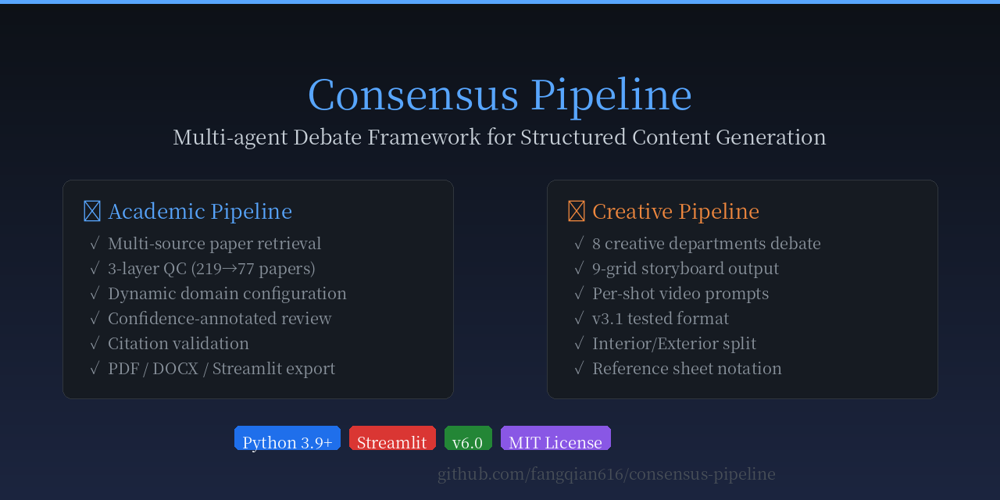
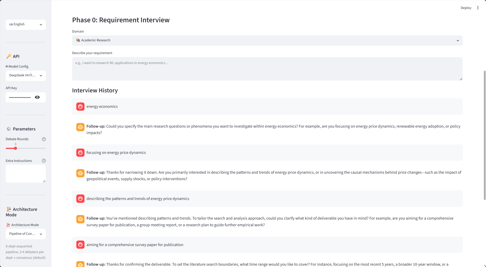
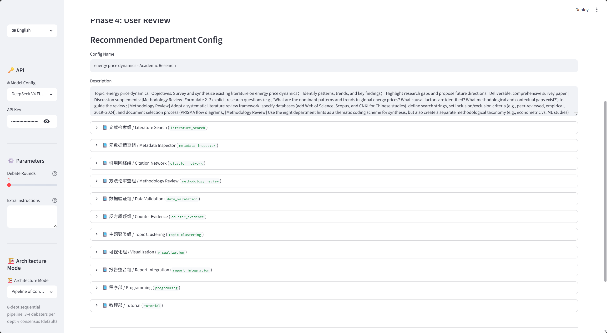
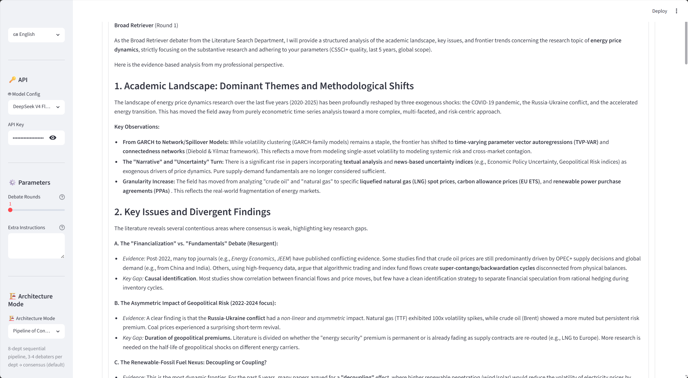
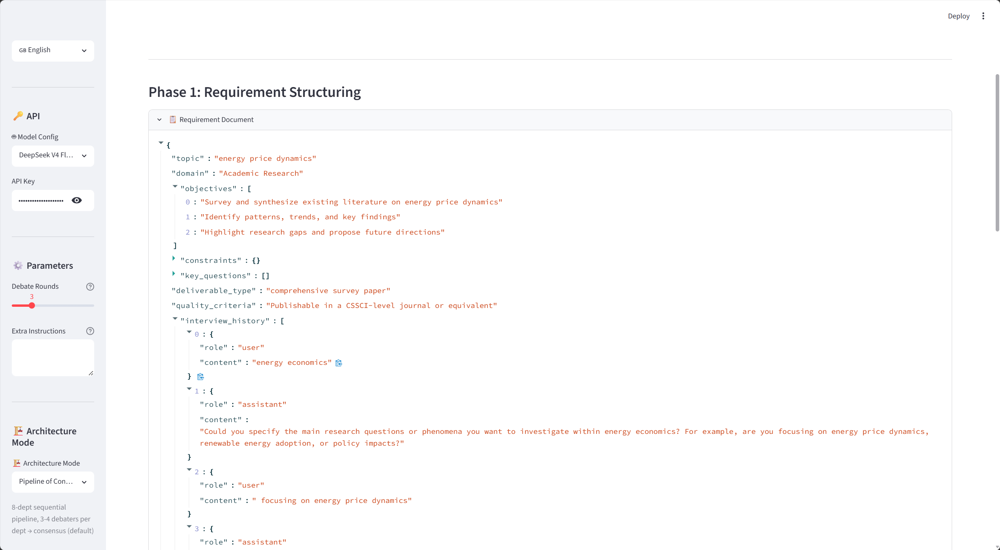
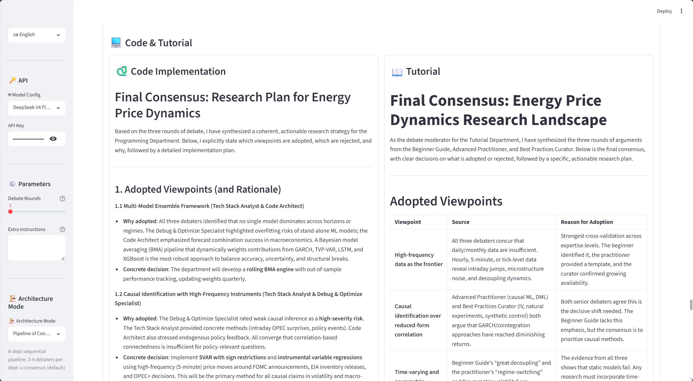
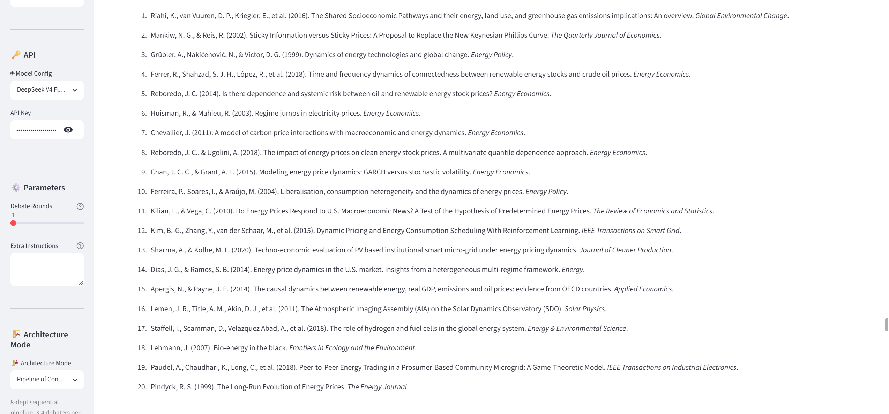

# 🧠 Consensus Pipeline

<p align="center">
  
</p>

<p align="center">
  
  
  
</p>

> **Multi-agent debate framework for academic research.**
> Instead of one AI writing a literature review for you — an AI team interviews you, debates each claim, reaches consensus with per-claim confidence scores, and verifies every citation against the source abstracts.

📖 [中文文档](README_CN.md) · 📦 [GitHub Releases](https://github.com/fangqian616/consensus-pipeline/releases)

---

## ⚡ Quick Start

Pick one of three paths (start with 1 or 2):

**🚀 1. One-shot installer (fastest)**

```bash
# Windows PowerShell
irm https://github.com/fangqian616/consensus-pipeline/raw/main/install.ps1 | iex
# macOS / Linux
curl -fsSL https://github.com/fangqian616/consensus-pipeline/raw/main/install.sh | bash
```

One command clones + installs deps + prints your MCP config.

**🤖 2. DSH plugin (AI-driven, recommended)**

```bash
git clone --depth 1 https://github.com/fangqian616/consensus-pipeline.git
npx -p @deepseek-ai/dsh dsh plugin --profile web add file:./consensus-pipeline/dsh-plugin
```

Then tell DSH "共识管线开始需求调研" — it runs the requirement interview → department config → multi-round debate → confidence-annotated report. The 📊 控制台 floating button (bottom-right) shows live progress, atomic verification, and full-text upload.

**🖥️ 3. Streamlit / CLI (manual)**

```bash
git clone https://github.com/fangqian616/consensus-pipeline.git
cd consensus-pipeline
pip install -r requirements.txt

# Set the key (export on Linux/macOS, $env: on PowerShell)
export DEEPSEEK_API_KEY="sk-your-key-here"

streamlit run app.py                              # web UI, browser opens
python run_pipeline_v2.py --topic "Your Topic"    # headless CLI
```

A full run takes 10-30 minutes, costs ~$0.05-0.10. Full details on all three paths (MCP config, full-text upload, custom endpoints) → [📖 Usage](#-usage)

---

## ❓ Why Not Just Ask ChatGPT?

A single LLM produces confident-sounding answers with no cross-validation — hallucinations slip through, conflicting perspectives get flattened, and you can't tell which conclusions are solid vs. speculative.

Consensus Pipeline replaces one-shot generation with **structured multi-agent debate as a quality gate**: every claim is challenged by independent "departments," contradictions are surfaced explicitly, and final conclusions carry **confidence annotations** (e.g., "42/77 papers, high confidence").

Think of it as built-in peer review — not a single author, but an adversarial committee.

---

## 📸 What It Looks Like

### Step 1: Requirement Interview
The pipeline starts by interviewing you — an AI agent asks clarifying questions to understand your research scope, constraints, and goals.



### Step 2: Smart Department Configuration
Based on your topic, the AI auto-generates 10+ specialized debate departments with multiple debaters per department. Each debater argues from a different methodological perspective.



### Step 3: Multi-Round Debate
Watch debaters argue in real-time. Each round, debaters present their position, challenge others' assumptions, and refine their arguments. The pipeline runs 3-8 rounds per department (default), stopping early once debaters converge via dynamic termination.



### Step 4: Structured Output
Debate results are structured into JSON with clear roles, positions, and consensus points — ready for report generation.



### Step 5: Report with Confidence Annotations
The final report includes per-claim confidence scores, methodology comparison matrices, and verified citations. Every conclusion tells you how many papers support it.

Full example report (148 papers, energy economics): see `examples/final_report.md`

### Bonus: Auto-Generated Code & References
The pipeline also generates runnable Python code for key methods and compiles a verified reference list.

<p float="left">
  
  
</p>

### Example Output

Here's what a real report excerpt looks like — note the per-claim confidence annotations:

> **Deep learning methods dominate short-term energy load forecasting** *(42/77 papers, high confidence)*
>
> LSTM and Transformer-based models consistently outperform traditional ARIMA methods by 10-40% in MAE metrics across multiple benchmark datasets. However, the **methodology review department flagged** widespread data leakage concerns — several studies used overlapping train/test splits that inflated apparent accuracy gains.
>
> **Graph neural networks show emerging potential in energy network optimization** *(3/77 papers, low confidence — trend not established)*
>
> While GNNs demonstrate structural advantages for modeling grid topology, current evidence is limited to small-scale test networks (< 100 nodes). Cross-department validation rated this claim as "promising but insufficiently validated."

Each claim survives adversarial challenge from multiple AI agents before appearing in the report. Claims that can't be verified from available abstracts are explicitly separated rather than silently scored.

---

## 🎯 What It Does

Consensus Pipeline takes a research topic and produces a structured literature review through multi-agent debate.

**The pipeline in one sentence:** Search papers → 3-layer QC filter → 11 departments debate each claim → cross-department validation → generate report with confidence scores.

**Key difference from tools like Elicit/Consensus:** Those tools extract and summarize. This tool *debates*. Each finding has to survive adversarial challenge from multiple AI agents before it makes it into the report.

**Core capabilities:**
- 🔍 **Multi-source paper search** — OpenAlex + Semantic Scholar + arXiv, auto-deduplication
- 🏛️ **11-department multi-agent debate** — each department has 2-4 debaters arguing from different perspectives
- 📊 **Per-claim confidence annotation** — every conclusion tagged with evidence count (e.g., "42/77 papers, high confidence")
- ✅ **NLI citation verification** — every claim checked against source abstracts, unverifiable claims excluded from scoring
- 📄 **Structured report output** — Markdown + DOCX + PDF export, bilingual (CN/EN)

**Full feature list:**
- ✅ Multi-source paper search (OpenAlex + Semantic Scholar + arXiv)
- ✅ 3-layer QC: hard filter → LLM classify → importance tagging (219 → 77 papers, ~65% exclusion)
- ✅ 10-11 debate departments, each with 2-4 debaters arguing from different perspectives
- ✅ Multi-round debate with **dynamic termination** — stance quantification (CV) + Kendall's W agreement; debate stops early once debaters converge instead of running fixed rounds
- ✅ Cross-department validation (one department checks another's work)
- ✅ Per-claim confidence annotation (e.g., "42/77 papers, high confidence")
- ✅ NLI citation verification — per-claim verdicts (✅/⚠️/❌), with unverifiable claims (📖 needs-fulltext / 📭 title-only) explicitly excluded from the confidence score, not silently counted
- ✅ Citation-mismatch vs overstatement classification — when both abstract AND full text are neutral, the verifier tells you *why*: ⚠️ wrong-paper citation vs ✂️ overstated wording
- ✅ Full-text NLI upgrade — abstract-neutral claims auto-recheck against the paper's real full text (OA via Unpaywall/Semantic Scholar, or your uploaded PDF)
- ✅ Meta-narrative claim filtering — report self-statistics ("this review included 215 papers") are excluded from verification, so they can't poison the confidence score
- ✅ Department-to-department consensus handoff — later departments see earlier departments' conclusions (no more isolated debate silos)
- ✅ Faithful-paraphrase rule — the report only transcribes what papers explicitly state (no invented data levels / mechanism directions)
- ✅ Full-text supplementation system — upload paywalled-paper PDFs, debate-midway breakpoint asks which "missing-but-necessary" papers to import, imported papers are force-included in the report
- ✅ Auto-generated runnable code for research methods
- ✅ PDF/DOCX export
- ✅ Bilingual output (`--lang en` or `--lang zh`)
- ✅ Streamlit UI with real-time debate monitoring + manual/auto convergence modes
- ✅ DSH control panel — atomic-verification card, full-text batch upload, one-click re-verify with progress bar, pending-import list (pause / continue / skip)
- ✅ One-shot installer — `irm …install.ps1 | iex` / `curl …install.sh | bash`
- ✅ DSH plugin bundle — `dsh plugin add` with auto-clone of the project
- ✅ Seed-paper import — your own PDFs are force-included in the debate + report

### What's still rough:
- ⚠️ Some UI labels are bilingual (Chinese/English mix) in English mode
- ⚠️ No GPU needed, but a full run takes 10-30 minutes and ~$0.05-0.10 in API costs
- ⚠️ Cross-department pairing logic is basic (two-layer fallback, not optimized)

---

## 🏗️ How It Works

| Phase | Stage | What happens |
|-------|-------|-------------|
| **0** | Requirement Interview | AI interviews you about scope, constraints & goals |
| **0.5** | Domain Config | AI generates the domain config (zero hardcoding) |
| **1** | Structuring | Scope & constraint extraction |
| **2** | Discussion | Multi-angle requirement discussion |
| **3** | Config Recommendation | Department configuration recommendation |
| **3.5** | QC Gate | 3-layer quality filter: `hard_filter → LLM_classify → tag_layer` |
| **4** | Paper Search | OpenAlex + Semantic Scholar + arXiv — dedup, abstract backfill |
| **4.9** | Full-text Fetch | Auto-fetch OA full text (Unpaywall → Semantic Scholar → OpenAlex) |
| **5** | Department Debate (v2) | 11 departments debate; stance quantification (CV) + Kendall's W → dynamic termination |
| **5.5** | Full-text Gate | Interactive breakpoint — import the few missing-but-necessary paywalled PDFs |
| **6** | Cross-Debate | Departments validate each other's conclusions |
| **7** | Report Generation | Literature review + confidence annotations + code + PDF/DOCX export |
| **7.5** | Citation Verification | NLI verification of every claim against source abstracts / full text |

### 11 Research Departments

| Department | What They Debate |
|-----------|-----------------|
| Literature Search | Which databases to query, what keywords to use, how broad vs. precise |
| Metadata Inspector | DOI verification, metadata completeness, source reliability |
| Citation Network | Citation analysis, impact metrics, influence mapping |
| Methodology Review | 7-dimension evaluation: accuracy, efficiency, interpretability, etc. |
| Data Validation | Data source quality, reproducibility, potential biases |
| Counter-Evidence | Anti-mainstream findings, controversy identification |
| Topic Clustering | Thematic grouping, trend detection, gap identification |
| Visualization | Chart analysis, distribution patterns, data representation |
| Report Integration | Synthesize department conclusions into the final structured report |
| Programming | Which tools/methods to recommend, runnable code generation |
| Tutorial | How to use research tools, methodological guidance |

### Confidence Annotation

Every conclusion in the report carries a confidence tag:

> Deep learning methods dominate short-term energy load forecasting **(42/77 papers, high confidence)**
>
> Graph neural networks show emerging potential in energy network optimization **(3/77 papers, low confidence — trend not established)**

No more unsupported claims.

### Citation Verification Report (NLI)

After the report is generated, a dedicated verifier checks **every claim against the retrieved abstracts** using natural language inference — no claim ships unexamined.

Each claim gets an explicit verdict:
- ✅ **Verified** — the abstract directly supports the claim
- ⚠️ **Partially verified** — only part of the claim is supported
- ❌ **Contradicted** — the abstract says otherwise
- ❓ **Unverified** — evidence is insufficient (counted in the score)

Claims that *cannot* be judged from abstracts alone are **honestly separated, not silently counted**:
- 📖 **Needs full-text** — the abstract doesn't cover this claim (excluded from scoring)
- 📭 **Title-only** — no abstract available (excluded from scoring)

The overall confidence score therefore reflects only claims the verifier could actually judge. Author metadata is injected during verification, so the checker first confirms *"this is the right paper"* before judging the content — catching mismatched citations that merely look plausible.

### Full-Text Supplementation System

Paywalled papers are the honest gap: the verifier can only judge a claim from its abstract, and many claims need the real full text. The pipeline closes this gap in two steps:

1. **Phase 4.9 — automatic (zero user effort).** Before debate, the pipeline crawls OA full text for every retrieved paper (Unpaywall → Semantic Scholar → OpenAlex) and matches any PDFs you've placed in `fulltext_papers/`.
2. **Phase 5.5 — interactive breakpoint.** After the first few debate departments, the pipeline extracts every paper the debate *actually cites*, finds the ones that are both **missing full text** and **necessary** (consensus-cited or cross-department), and asks you to import just those few.
3. **Full-text NLI upgrade.** When an abstract is neutral, the verifier fetches the full text and re-checks: entail → ✅ verified; contradict → ❌; still neutral → classified as ⚠️ **citation mismatch** (wrong paper) or ✂️ **overstated claim** (right paper, wording too strong).
4. **Force-include.** Papers you import are marked `weight=core` and guaranteed a spot in the report — your uploads never go to waste.

Upload PDFs two ways:
- **DSH control panel** — batch upload (any filename; the DOI is auto-extracted from inside the PDF), then one-click re-verify
- **Drop files** into `fulltext_papers/`, then run `--rerun-67` to regenerate just the report + verification stage

### QC Department (3-Layer Filter)

The biggest quality gate. Three layers ensure zero pollution:
- **Layer 1 — Hard Filter**: Remove obviously off-topic papers via LLM-generated exclusion signals
- **Layer 2 — LLM Classify**: LLM judges each paper's domain membership
- **Layer 3 — Importance Tagging**: Classify into core / method / background tiers

Result on energy economics: 219 → 77 papers, 64.8% exclusion rate.

### Dynamic Domain Config

No hardcoded keywords. The LLM generates everything based on your topic — exclusion signals, query rotation, tier definitions. Change from "ML in Energy Economics" to "LLM in Healthcare"? Zero code changes.

---

## 📖 Usage

Three ways to run Consensus Pipeline. Pick one:

| Entry | Best for |
|-------|----------|
| **🚀 One-shot installer** | Fastest start — one command clones + installs + prints config |
| **🤖 DSH / MCP (AI agent)** | Let an AI agent drive it from chat (DeepSeek Harness, Claude, Cursor…) |
| **🖥️ Streamlit / CLI (manual)** | Run locally yourself, watch debates, script it |

---

### 🚀 Way 1: One-Shot Installer (recommended)

Send someone a single command and it self-installs. No separate clone / pip / config steps.

**Windows (PowerShell):**

```powershell
irm https://github.com/fangqian616/consensus-pipeline/raw/main/install.ps1 | iex
```

**macOS / Linux:**

```bash
curl -fsSL https://github.com/fangqian616/consensus-pipeline/raw/main/install.sh | bash
```

What it does: `git clone` → `pip install -r requirements.txt` → prints the `mcp.json` snippet for your MCP client.

Then paste the printed snippet into your MCP client (`mcpServers.consensus-pipeline` → `python mcp_server.py`). Supported: Claude Desktop, Cursor, Codex, and any MCP-compatible agent.

> 💡 Requires `git` and `python3.10+`. The first `pip install` takes 1-2 minutes.

---

### 🤖 Way 2: AI Agent (DSH / MCP)

#### DSH (DeepSeek Harness) — native tools + control panel

Install as a bundle (auto-registers native tools + the `/consensus-pipeline/` panel):

```bash
git clone --depth 1 https://github.com/fangqian616/consensus-pipeline.git
npx -p @deepseek-ai/dsh dsh plugin --profile web add file:./consensus-pipeline/dsh-plugin
```

Or, for local development, link the plugin dir into DSH's `node_modules` and restart.

On first use, the plugin auto-clones the full project to `~/.dsh/consensus-pipeline` (so the Python `mcp_server.py` is always present — no manual clone needed). The **📊 控制台** floating button appears bottom-right.

**Daily use:**

1. Tell the agent your research direction in chat → it runs the requirement interview, then starts the pipeline.
2. Click **📊 控制台** to open the panel — live progress, atomic verification, full-text upload.
3. At the Phase 5.5 breakpoint, a **⏳ pending-import list** appears: pause, drop in paywalled PDFs, continue.

> 💡 **Tip:** To start the pipeline via DSH, try saying: **"共识管线开始需求调研"** — DSH will launch the requirement interview and guide you through the full pipeline and ~$0.05-0.10 in API costs

#### Any MCP client (Claude Desktop / Cursor / Codex…)

The MCP server is zero-dependency (pure stdlib). Point any MCP client at it:

```json
{
  "mcpServers": {
    "consensus-pipeline": {
      "command": "python",
      "args": ["/path/to/consensus-pipeline/mcp_server.py"]
    }
  }
}
```

The one-shot installer above prints exactly this snippet for you.

---

### 🖥️ Way 3: Streamlit / CLI (manual)

Run it yourself — visual UI or headless script.

#### Streamlit Web UI

```bash
git clone https://github.com/fangqian616/consensus-pipeline.git
cd consensus-pipeline
pip install -r requirements.txt
streamlit run app.py
```

Browser opens to `http://localhost:8501`. In the sidebar: paste your DeepSeek API key, pick a language, then start the academic pipeline — the AI interviewer asks about your topic, generates the debate departments, and the multi-round debate runs with live monitoring.

#### CLI (headless)

```bash
git clone https://github.com/fangqian616/consensus-pipeline.git
cd consensus-pipeline
pip install -r requirements.txt
```

Set the API key:

```bash
# Linux/macOS
export DEEPSEEK_API_KEY="sk-your-key-here"
# Windows (PowerShell)
$env:DEEPSEEK_API_KEY="sk-your-key-here"
# …or create a .env in the project root: DEEPSEEK_API_KEY=sk-your-key-here
```

Run the **v2 pipeline** (recommended — stance quantification + dynamic termination):

```bash
python run_pipeline_v2.py --topic "Machine Learning in Energy Economics" --lang en
# 中文（默认）
python run_pipeline_v2.py --topic "碳市场价格预测与能源转型关联机制研究"
```

Optional requirement research first (Phase 0-3 → department config):

```bash
python run_requirement_research.py --topic "你的课题"
```

Re-run only the report + verification stage (after adding full-text PDFs):

```bash
python run_pipeline_v2.py --topic "你的课题" --output-dir "v2_run_output/<run-dir>" --rerun-67
```

Output lands in `v2_run_output/<date>_<topic>/` (v2) or `run_output/` (v1) — Markdown + DOCX reports, `citation_verification.json`, debate logs, and generated charts.

#### Full-Text Supplementation (paywalled papers)

Papers behind paywalls can't be verified from their abstract alone. Two ways to close the gap:

- **DSH control panel** — batch-upload paywalled PDFs (any filename; DOI auto-extracted), one-click re-verify with a progress bar, pending-import list with pause / continue / skip.
- **CLI `--rerun-67`** — drop PDFs into `fulltext_papers/`, then regenerate only the report + verification stage (reuses the finished debate).

#### Custom API Endpoint (optional)

Any OpenAI-compatible API works:

```bash
export DEEPSEEK_API_KEY="your-key"
export DEEPSEEK_MODEL="deepseek-v4-flash"   # or deepseek-v4-pro
python run_pipeline_v2.py --topic "Your Topic" --lang en
```

---

## 📋 Prerequisites

| Requirement | Details |
|-------------|---------|
| Python 3.10+ | 3.11+ recommended |
| DeepSeek API Key | [Register](https://platform.deepseek.com/) — ~$0.05-0.10 per full run |
| git | For the one-shot installer / clone |
| Internet | Access to DeepSeek API (custom endpoints supported) |

> 💡 No GPU needed. No database needed. Paper retrieval uses free open APIs (arXiv / Semantic Scholar / OpenAlex).

---

## ⚙️ Configuration

### API Keys

| Variable | Required | Description |
|----------|----------|-------------|
| `DEEPSEEK_API_KEY` | ✅ Yes | API key for LLM calls |
| `EASYSCHOLAR_SECRET_KEY` | No | Enhanced journal ranking (optional, falls back to 209-journal local registry) |

### Supported Models

| Provider | API URL | Tested With |
|----------|--------|-------------|
| DeepSeek | `https://api.deepseek.com/v1` | `deepseek-v4-flash` (debate), `deepseek-v4-pro` (verify/report) |
| OpenAI | `https://api.openai.com/v1` | `gpt-4o` (compatible) |
| Custom | Any OpenAI-compatible endpoint | Any model |

Set API key and model in the Streamlit sidebar, or via environment variables.

---

## 📁 Project Structure

```
consensus-pipeline/
├── install.ps1 / install.sh     # One-shot installers (clone + pip + mcp.json)
├── app.py                       # Streamlit main app
├── router.py                    # AI Router — smart department config
├── debate_engine.py             # Core debate engine
├── config_manager.py            # Config persistence & presets
├── run_pipeline.py              # CLI runner (v1)
├── run_pipeline_v2.py           # CLI runner (v2) — stance quantification + dynamic termination
├── stance_quant_v2.py           # v2 stance quantification (CV + Kendall's W convergence)
├── run_requirement_research.py  # Requirement research (Phase 0-3)
├── paper_importer.py            # Seed-paper import (PDF → metadata)
├── consensus_meter.py           # Consensus gauge dashboard
├── mcp_server.py                # MCP server (zero-dependency)
├── panel.html                   # DSH control panel (verification card + full-text upload)
├── dsh-plugin/                  # DSH plugin bundle (mounts /consensus-pipeline/ + native tools)
│   ├── index.js                 #   panel routes + JSON-RPC tools + auto-clone
│   └── cordis.patch.yml         #   bundle patch
├── fulltext_papers/             # User-uploaded paywalled-paper PDFs (gitignored)
├── quality_controller.py        # QC department (3-layer filter)
├── domain_config_generator.py   # Dynamic domain config
├── docx_exporter.py             # Word export
├── pdf_exporter.py              # PDF export
├── academic/                    # Academic research module
│   ├── search_engine.py         # Multi-source paper search
│   ├── journal_classifier.py    # Journal quality sieve
│   ├── journal_registry.py      # 209-journal local registry
│   ├── cross_validator.py       # Cross-validation & topic clustering
│   ├── report_generator.py      # Report generation with confidence
│   ├── report_visualizer.py     # Report charts
│   └── visualizer.py            # Academic charts (trends, distributions)
├── requirement/                 # Requirement & verification module
│   ├── interviewer.py           # AI interview agent
│   ├── structurer.py            # Scope & constraint extraction
│   ├── discussion_group.py      # Multi-angle requirement discussion
│   ├── config_recommender.py    # Department config recommendation
│   ├── citation_verifier.py     # NLI citation verification (full-text upgrade + mismatch/overstatement)
│   └── fact_checker.py          # Key-conclusion fact checking
├── templates/                   # Debate prompt templates
├── presets/                     # Built-in presets
├── docs/                        # Quickstart & preset guides
├── examples/                    # Screenshots & example outputs
└── user_profiles/               # Interview profiles
```

---

## 🗺️ Roadmap

| Priority | Feature | Status |
|----------|---------|--------|
| P0 | Fix UI labels bilingual in EN mode | In progress |
| P1 | Semantic citation verification | ✅ Shipped in v0.12 (NLI-based) |
| P1 | Sub-topic query splitting | Planned |
| P1 | Publication bias detection (funnel plot) | Planned |
| P2 | Cross-language retrieval (CNKI + bilingual alignment) | Planned |
| P2 | Incremental update capability | Planned |
| P2 | Evaluation metrics for debate quality | Planned |

---

## ❓ FAQ

**Q: How long does a full run take?**
A: 10-30 minutes depending on topic and paper count. The debate phase is the bottleneck — more departments = more API calls.

**Q: How much does it cost?**
A: With DeepSeek pricing, a full run (148 papers, 11 departments, 3-8 rounds each) costs ~$0.05-0.10.

**Q: Which models are supported?**
A: Any OpenAI-compatible API. Tested primarily with DeepSeek. Should work with local models via custom endpoints — haven't tested yet.

**Q: What languages does the output support?**
A: Academic pipeline: Chinese (`--lang zh`, default) and English (`--lang en`). Some UI labels are still bilingual in English mode — working on it.

**Q: Can I customize the departments?**
A: Yes. The AI auto-generates departments based on your topic, and you can edit/add/remove them in the Streamlit UI before starting the debate.

**Q: How is this different from Elicit or Consensus.app?**
A: Those tools extract and summarize. This tool debates — each finding has to survive adversarial challenge from multiple AI agents before it makes it into the report. The trade-off: slower and more expensive, but catches contradictions that single-pass summarization misses.

**Q: Is the debate actually worth it?**
A: Yes, clearly. I ran both modes. Without debate, the report just summarizes what papers claim. With debate, agents from different perspectives challenge each other — and those challenges make it into the report. Example: the "accuracy" agent reported decomposition methods achieve 10-40% error reduction. The "methodology rigor" agent flagged widespread data leakage in those same papers. Both perspectives are in the final report. Without debate, only the accuracy claim would've survived. What I can't quantify yet is *how much* better the overall report is — working on evaluation metrics.

---

## 🤝 Contributing

PRs welcome! Especially:
- 🐛 Bug fixes
- 📝 Documentation improvements
- 🎭 New debater perspectives
- 📊 Evaluation benchmarks for multi-agent debate quality

---

## 📄 License

MIT License

---

> This is a student project, actively developed and tested. Feedback, bug reports, and "have you tried X?" suggestions are all welcome.

---

If Consensus Pipeline helps your research, a ⭐ on GitHub means a lot — it helps others find the project.
