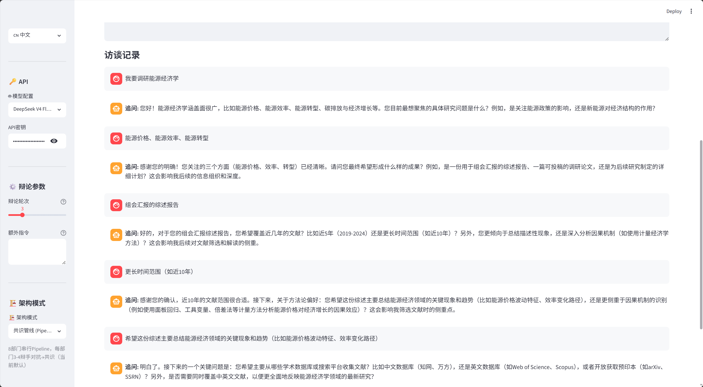
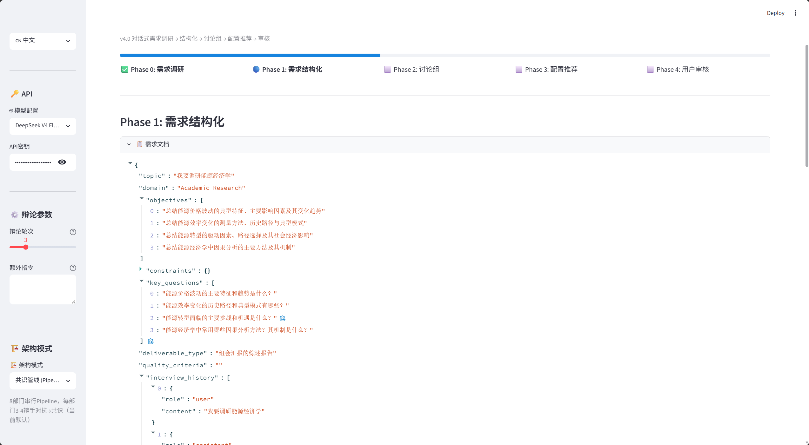

# 🧠 Consensus Pipeline 共识管线

<p align="center">
  
</p>

<p align="center">
  
  
  
  
</p>

> **多 Agent 辩论驱动的学术研究框架。**
> 不是单个 AI 替你写文献综述——是一支 AI 团队访谈你、辩论每条主张、达成共识，并给每条结论标注置信度。

📖 [English](README.md) · 📦 [GitHub Releases](https://github.com/fangqian616/consensus-pipeline/releases)

---

## ❓ 为什么不直接问 ChatGPT？

单个 LLM 产出的答案听起来很自信，但没有交叉验证——幻觉混入其中，冲突视角被压平，你分不清哪些结论可靠、哪些是推测。

Consensus Pipeline 用**结构化多 Agent 辩论作为质量门控**替代一次性生成：每条主张都被独立"部门"挑战，矛盾被显式暴露，最终结论带有**置信度标注**（如"42/77 篇支撑，高置信度"）。

相当于自带同行评审——不是一个作者，而是一个对抗性委员会。

---

## 📸 效果展示

### 第一步：需求访谈
AI 智能体会先访谈你，了解研究范围、约束条件和目标。



### 第二步：智能部门配置
AI 根据你的主题自动生成 10+ 个专业辩论部门，每个部门配备多位辩手，从不同方法论角度展开辩论。


### 第三步：多轮辩论
实时观看辩手辩论。每轮辩手陈述立场、挑战他人假设、完善论证。每个部门运行 2-3 轮后达成共识。


### 第四步：结构化输出
辩论结果结构化输出为 JSON，清晰标注角色、立场和共识点，为报告生成做好准备。



### 第五步：带置信度标注的综述报告
最终报告包含逐条结论的置信度评分、方法论对比矩阵和已验证的引用文献。每条结论都标注支撑论文数量。

完整报告示例（148 篇论文，能源经济学方向）：见 `examples/final_report.md`

### 附加产出：自动生成代码与参考文献
管线还会生成可运行的 Python 代码和经过校验的参考文献列表。

<p float="left">
  
  
</p>

---

## 🎯 功能概述

Consensus Pipeline 输入一个研究主题，通过多 Agent 辩论产出结构化文献综述。

**一句话总结：** 检索论文 → 三层 QC 过滤 → 10 个部门辩论每条主张 → 跨部门交叉验证 → 生成带置信度评分的综述报告。

**与 Elicit/Consensus.app 的关键区别：** 那些工具是提取和总结，这个工具是**辩论**。每条结论在进入报告之前，必须经受多个 AI 智能体的对抗性质疑。

### 实际可用功能（v0.7.8）：
- ✅ 多源论文检索（OpenAlex + Semantic Scholar + arXiv）
- ✅ 三层 QC 过滤：硬过滤 → LLM 分类 → 重要性标注（219 → 77 篇，排除率 ~65%）
- ✅ 10-11 个辩论部门，每部门 2-4 位辩手从不同视角辩论
- ✅ 多轮辩论（每部门 2-3 轮）
- ✅ 跨部门交叉验证（部门之间互相检查结论）
- ✅ 逐条结论置信度标注（如"42/77 篇支撑，高置信度"）
- ✅ 引用校验（自动验证所有 `[N]` 引用）
- ✅ 自动生成可运行的研究方法代码
- ✅ PDF/DOCX 导出
- ✅ 双语输出（`--lang en` 或 `--lang zh`）
- ✅ Streamlit 可视化界面，实时监控辩论进程

### 待改进：
- ⚠️ 部分 UI 标签在英文模式下仍有中英混合
- ⚠️ 跨部门配对逻辑较基础（两层回退，未优化）
- ⚠️ 完整运行需 10-30 分钟，API 费用约 $0.05-0.10

---

## 🏗️ 工作原理

```
研究主题
     │
     ▼
┌─────────────────────────┐
│ Phase 0: 需求访谈       │  ← AI 智能体访谈你的研究范围和目标
└────────────┬────────────┘
             │
             ▼
┌─────────────────────────┐
│ Phase 1: 智能配置       │  ← AI 根据主题生成辩论部门和辩手
│ （自动或手动）          │     零硬编码
└────────────┬────────────┘
             │
             ▼
┌─────────────────────────┐
│ Phase 2: 论文检索       │  ← OpenAlex（主）+ Semantic Scholar + arXiv
│                          │     去重、摘要回填
└────────────┬────────────┘
             │
             ▼
┌─────────────────────────┐
│ Phase 3: QC 审校部门   │  ← 三层过滤：
│ 质量控制                 │     hard_filter → LLM_classify → tag_layer
│                          │     219 篇 → 77 篇（core/method/background）
└────────────┬────────────┘
             │
             ▼
┌─────────────────────────┐
│ Phase 4: 部门辩论       │  ← 10+ 研究部门辩论
│ （多轮）                 │     每部门：2-4 辩手 → 2-3 轮 → 共识
│                          │     辩手从不同方法论视角辩论
└────────────┬────────────┘
             │
             ▼
┌─────────────────────────┐
│ Phase 5: 跨部门验证     │  ← 部门之间互相检查结论
│                          │     发现盲点和群体思维
└────────────┬────────────┘
             │
             ▼
┌─────────────────────────┐
│ Phase 6: 报告生成       │  ← 带置信度标注的文献综述
│                          │     引用校验、代码生成、PDF/DOCX 导出
└─────────────────────────┘
```

### 10 个研究部门

| 部门 | 辩论内容 |
|------|---------|
| 文献检索 | 检索哪些数据库、用什么关键词、广度 vs 精度 |
| 元数据检查 | DOI 验证、元数据完整性、来源可靠性 |
| 引用网络 | 引用分析、影响力指标、影响力图谱 |
| 方法论评审 | 7 维度评估：准确度、效率、可解释性等 |
| 数据验证 | 数据源质量、可复现性、潜在偏差 |
| 反证部门 | 反主流发现、争议识别 |
| 主题聚类 | 主题分组、趋势检测、空白识别 |
| 可视化 | 图表分析、分布模式、数据呈现 |
| 编程 | 推荐工具/方法，生成可运行代码 |
| 教程 | 教授研究工具使用方法，提供方法论指导 |

### 置信度标注

报告中每条结论都带有置信度标签：

> 深度学习方法主导短期能源负荷预测 **（42/77 篇支撑，高置信度）**
>
> 图神经网络在能源网络优化中显示新兴潜力 **（3/77 篇支撑，低置信度——趋势未建立）**

不再有无支撑的断言。

### QC 审校部门（三层过滤）

最大的质量关口。三层过滤确保零污染：
- **第一层——硬过滤**：通过 LLM 生成的排除信号直接剔除明显不相关论文
- **第二层——LLM 分类**：LLM 逐篇判定论文的领域归属
- **第三层——重要性标注**：将论文分为 core / method / background 三级

能源经济学实测：219 → 77 篇，排除率 64.8%。

### 动态领域配置

零硬编码关键词。LLM 根据你的主题生成一切——排除信号、搜索词轮换、分级定义。从"能源经济学中的 ML"换到"医疗中的 LLM"？零代码改动。

---

## 📖 使用教程

两种运行方式：**Streamlit 网页界面**（交互式、可视化）或**命令行直接启动**（无头、可脚本化）。两者产出相同——根据你的工作流选择。

---

### 🖥️ 方式一：Streamlit 网页界面

适合：交互式探索主题、实时观看辩论、随时调整部门配置。

#### 第一步：安装并启动

```bash
git clone https://github.com/fangqian616/consensus-pipeline.git
cd consensus-pipeline
pip install -r requirements.txt
streamlit run app.py
```

浏览器自动打开 `http://localhost:8501`。左侧边栏是你的控制面板——一切从这里开始。

#### 第二步：配置 API Key 和语言

在左侧边栏中：

1. **API Key** — 粘贴你的 DeepSeek API key（或任何 OpenAI 兼容的 key）。[点击获取](https://platform.deepseek.com/)。Key 仅保存在当前会话中，不会写入磁盘。
2. **语言** — 在 🇨🇳 中文和 🇬🇧 English 之间切换。这控制**所有**输出：辩论内容、界面标签和最终报告。
3. **模型** — 默认 `deepseek-chat`。如果使用其他服务商，可以修改 API 端点和模型名称。


#### 第三步：选择管线模式

应用支持两种模式——选择匹配你目标的模式：

| 模式 | 标签页 | 功能 |
|------|--------|------|
| **学术研究** | `📚 学术` | 论文检索 → 多 Agent 辩论 → 带置信度评分的文献综述 |
| **创意/动画** | `🎬 动画` | 剧本写作 → 分镜 → 素材生成（视频制作） |

> 💡 做文献综述请使用 **学术** 标签页。本教程聚焦学术管线。

#### 第四步：启动学术管线

1. 点击 **📚 学术** 标签页。
2. 输入研究主题。尽量具体——AI 访谈员会追问以缩小范围。示例主题：
   - `"机器学习在碳价预测中的应用"`
   - `"能源政策评估的因果推断方法"`
   - `"碳市场对电力价格的影响：系统性综述"`
3. AI 访谈员会追问你的研究范围、约束条件和目标。认真回答——这决定整个管线的走向。
4. 审阅**自动生成的部门配置**。AI 根据你的主题创建 10+ 个辩论部门及专业辩手。你可以在启动前编辑、添加或删除部门。

#### 第五步：观看辩论

确认配置后，管线自动运行：

1. **论文检索**（1-2 分钟）— 多源检索 OpenAlex、Semantic Scholar、arXiv。
2. **QC 过滤**（1-2 分钟）— 三层质量筛：硬过滤 → LLM 分类 → 重要性标注。约 65% 论文被排除。
3. **部门辩论**（5-20 分钟）— 10+ 部门实时辩论。每部门 2-3 轮。你可以在 Streamlit 界面实时观看辩论过程。
4. **跨部门验证**（2-5 分钟）— 部门之间互相检查结论。
5. **报告生成**（1-2 分钟）— 最终文献综述，含置信度标注、已验证引用和可运行代码。

#### 第六步：下载结果

管线完成后，你可以获得：

- **📄 文献综述**（PDF/DOCX）— 含逐条结论置信度评分
- **💻 生成代码** — 关键方法的可运行 Python 脚本
- **📊 辩论日志** — 完整辩论记录，可供审计

---

### ⌨️ 方式二：命令行直接启动

适合：批量处理、脚本化、CI/CD，或不需要可视化界面时。

#### 第一步：安装依赖

```bash
git clone https://github.com/fangqian616/consensus-pipeline.git
cd consensus-pipeline
pip install -r requirements.txt
```

#### 第二步：设置 API Key

```bash
# Linux/macOS
export DEEPSEEK_API_KEY="sk-your-key-here"

# Windows (PowerShell)
$env:DEEPSEEK_API_KEY="sk-your-key-here"

# Windows (CMD)
set DEEPSEEK_API_KEY=sk-your-key-here
```

> 💡 也可以在项目根目录创建 `.env` 文件：`DEEPSEEK_API_KEY=sk-your-key-here`

#### 第三步：运行管线

**基础用法——中文输出（默认）：**

```bash
python run_pipeline.py --topic "碳市场价格预测与能源转型关联机制研究"
```

**英文输出：**

```bash
python run_pipeline.py --topic "Machine Learning in Energy Economics" --lang en
```

**完整参数说明：**

| 参数 | 必需 | 默认值 | 说明 |
|------|------|--------|------|
| `--topic` | ✅ 是 | — | 研究主题（任意语言） |
| `--lang` | 否 | `zh` | 输出语言：`zh`（中文）或 `en`（英文） |

#### 第四步：找到输出文件

所有输出文件保存在 `output/` 目录：

```
output/
├── report_<主题>_<时间戳>.docx    # Word 报告，含置信度标注
├── report_<主题>_<时间戳>.pdf     # PDF 版本
├── code_<主题>_<时间戳>.py        # 生成的可运行代码
└── debate_logs/                   # 完整辩论记录
```

#### 第五步：自定义 API 端点（可选）

使用其他模型服务商？设置端点和模型：

```bash
export DEEPSEEK_API_KEY="your-key"
export DEEPSEEK_API_BASE="https://api.openai.com/v1"
export DEEPSEEK_MODEL="gpt-4o"

python run_pipeline.py --topic "你的主题" --lang zh
```

任何 OpenAI 兼容 API 均可使用——DeepSeek、OpenAI、Ollama/vLLM 本地模型等。

---

### 🔄 我该选哪种？

| 场景 | Streamlit | 命令行 |
|------|-----------|--------|
| 第一次探索工具 | ✅ 推荐 | — |
| 想实时观看辩论 | ✅ | — |
| 需要调整部门配置 | ✅ | — |
| 批量处理多个主题 | — | ✅ |
| 脚本/自动化 | — | ✅ |
| 无头服务器运行 | — | ✅ |
| CI/CD 集成 | — | ✅ |

---

## 📋 前提条件

| 要求 | 说明 |
|------|------|
| Python 3.9+ | 推荐 3.11+ |
| DeepSeek API Key | [注册](https://platform.deepseek.com/) — 每次完整运行约 $0.05-0.10 |
| 网络 | 需访问 DeepSeek API（支持自定义端点） |

> 💡 不需要 GPU，不需要数据库。论文检索使用免费开放 API（arXiv / Semantic Scholar / OpenAlex）。

---

## ⚙️ 配置

### API 密钥

| 变量 | 必需 | 说明 |
|------|------|------|
| `DEEPSEEK_API_KEY` | ✅ 是 | LLM 调用的 API 密钥 |
| `EASYSCHOLAR_SECRET_KEY` | 否 | 增强期刊排名（可选，默认使用 209 期刊本地注册表） |

### 支持的模型

| 服务商 | API 地址 | 已测试 |
|--------|---------|--------|
| DeepSeek | `https://api.deepseek.com/v1` | `deepseek-chat`（主力） |
| OpenAI | `https://api.openai.com/v1` | `gpt-4o`（兼容） |
| 自定义 | 任意 OpenAI 兼容端点 | 任意模型 |

在 Streamlit 侧边栏或环境变量中设置 API 密钥和模型。

---

## 📁 项目结构

```
consensus-pipeline/
├── app.py                       # Streamlit 主界面
├── router.py                    # AI Router — 智能部门配置
├── debate_engine.py             # 核心辩论引擎
├── config_manager.py            # 配置持久化与预设
├── run_pipeline.py              # CLI 无头运行器
├── quality_controller.py        # QC 审校部门（三层过滤）
├── domain_config_generator.py   # 动态领域配置
├── report_generator.py          # 带置信度的报告生成
├── docx_exporter.py             # Word 导出
├── pdf_exporter.py              # PDF 导出
├── academic/                    # 学术研究模块
│   ├── search_engine.py         # 多源检索
│   ├── journal_classifier.py   # 期刊质量筛
│   ├── journal_registry.py     # 209 期刊本地注册表
│   ├── fact_checker.py         # 自动化事实核查
│   └── __init__.py
├── requirement/                 # 需求研究模块
│   ├── interviewer.py           # AI 访谈智能体
│   ├── structurer.py            # 范围与约束提取
│   ├── generator.py             # 需求文档生成
│   ├── validator.py             # 完整性检查
│   └── __init__.py
├── templates/                   # 辩论提示词模板
├── presets/                     # 内置预设
├── examples/                    # 截图与示例输出
└── fonts/                       # 中文字体（霞鹜文楷）
```

---

## 🗺️ 版本历史

| 版本 | 日期 | 变更 |
|------|------|------|
| **v0.7.8** | 2026-07-21 | 修复中英文语言输出对称性（9 处英文 + 13 处中文强制指令）、最终报告语言泄漏修复、双语全链路测试通过 |
| **v0.7.7** | 2026-07-20 | 回退 daemon 线程方案为同步执行，修复辩论中断 bug |
| **v0.7.5** | 2026-07-17 | UI 9→4 Tab 重组、easyScholar 降级、README 全面重写、语言选择前置 |
| **v0.7.3** | 2026-07-17 | 修复辩论轮次参数处理（多轮辩论循环） |
| **v0.7.2** | 2026-07-17 | 英文报告输出（`--lang en`）、GitHub 旧 tag 清理 |
| **v0.7.1** | 2026-07-17 | 首个开源版本：QC 审校部门、动态领域配置、引用校验、置信度标注、OpenAlex 优先 |

> v0.7.1 之前的版本为内部开发版，未公开发布。

---

## 🗺️ 路线图

| 优先级 | 功能 | 状态 |
|--------|------|------|
| P0 | 修复英文模式 UI 标签中英混合 | 进行中 |
| P1 | 语义引用校验（embedding） | 规划中 |
| P1 | 子主题 query 拆分 | 规划中 |
| P1 | 发表偏倚检测（漏斗图） | 规划中 |
| P2 | 跨语言检索（知网 + 双语对齐） | 规划中 |
| P2 | 增量更新能力 | 规划中 |
| P2 | 辩论质量评估指标 | 规划中 |

---

## ❓ 常见问题

**Q: 完整运行需要多长时间？**
A: 10-30 分钟，取决于主题和论文数量。辩论阶段是瓶颈——部门越多，API 调用越多。

**Q: 费用多少？**
A: 以 DeepSeek 定价，一次完整运行（148 篇论文、10 个部门、每部门 2-3 轮）约 $0.05-0.10。

**Q: 支持哪些模型？**
A: 任何 OpenAI 兼容 API。主力测试使用 DeepSeek。理论上支持本地模型（通过自定义端点），尚未充分测试。

**Q: 输出支持哪些语言？**
A: 学术管线：中文（`--lang zh`，默认）和英文（`--lang en`）。Streamlit 界面支持中英文。

**Q: 可以自定义部门吗？**
A: 可以。AI 根据你的主题自动生成部门，你可以在 Streamlit 界面中编辑、添加或删除部门后再启动辩论。

**Q: 和 Elicit 或 Consensus.app 有什么区别？**
A: 那些工具是提取和总结。这个工具是**辩论**——每条结论在进入报告之前，必须经受多个 AI 智能体的对抗性质疑。代价是更慢、更贵，但能发现单次摘要遗漏的矛盾。

**Q: 辩论真的有用吗？**
A: 有用，而且很明显。我们跑了对比测试：不开辩论，报告只是总结论文声称的内容。开辩论后，不同视角的智能体互相挑战——这些挑战会进入最终报告。例如，"准确度"部门报告分解方法可降低 10-40% 误差，"方法论严谨性"部门则指出这些论文普遍存在数据泄漏。两个视角都出现在最终报告中。不开辩论，只有准确度那条会留下来。目前还无法量化整体报告质量提升了多少——评估指标正在开发中。

---

## 🤝 贡献

欢迎 PR！特别需要：
- 🐛 Bug 修复
- 📝 文档改进
- 🎭 新辩手视角
- 📊 多 Agent 辩论质量的评估基准

---

## 📄 许可证

MIT License

---

> 这是一个学生项目，正在积极开发和测试中。欢迎反馈、Bug 报告和"你试过 XX 吗？"的建议。

---

