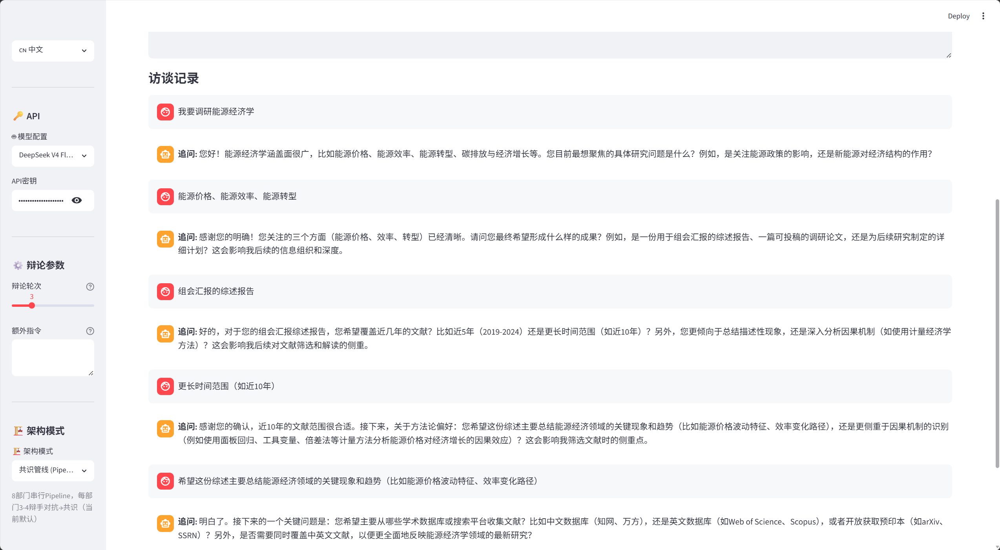
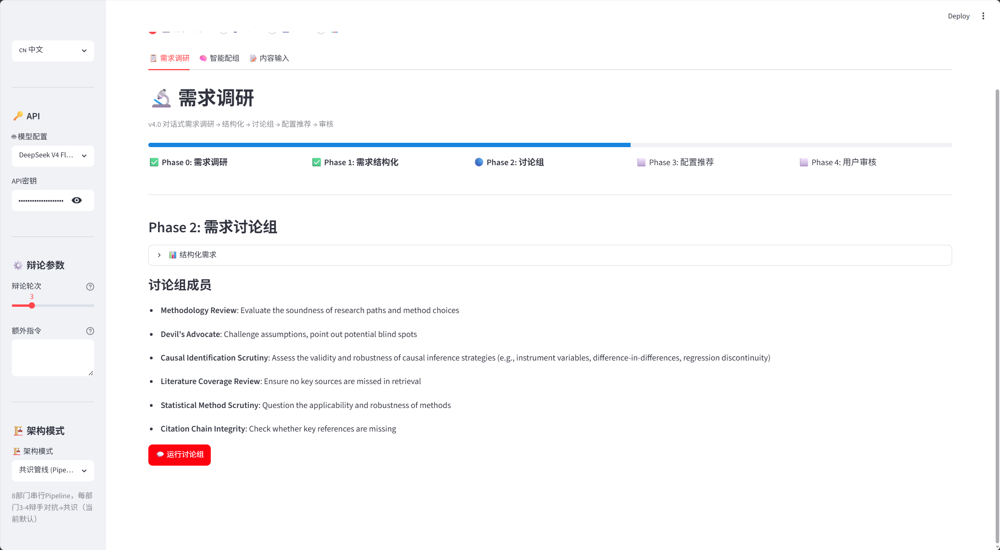
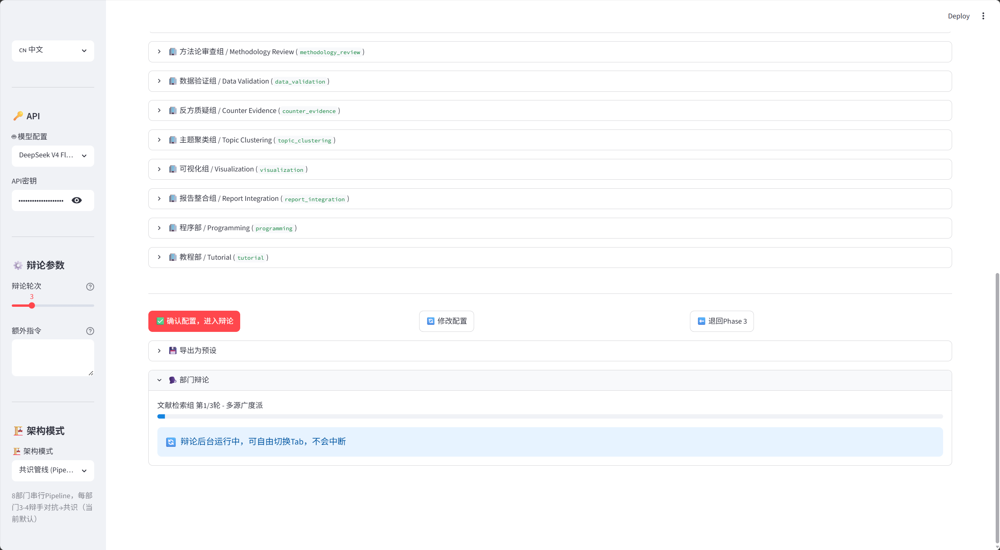
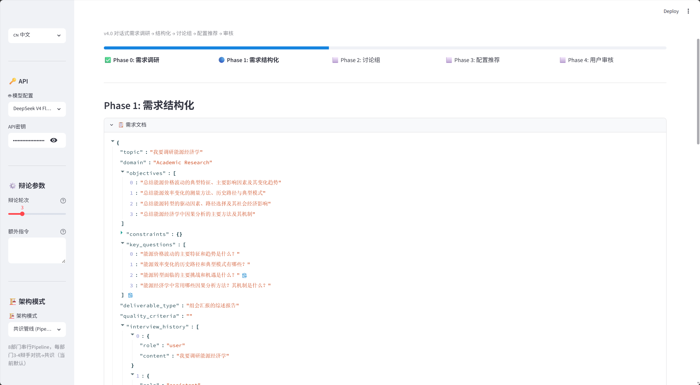
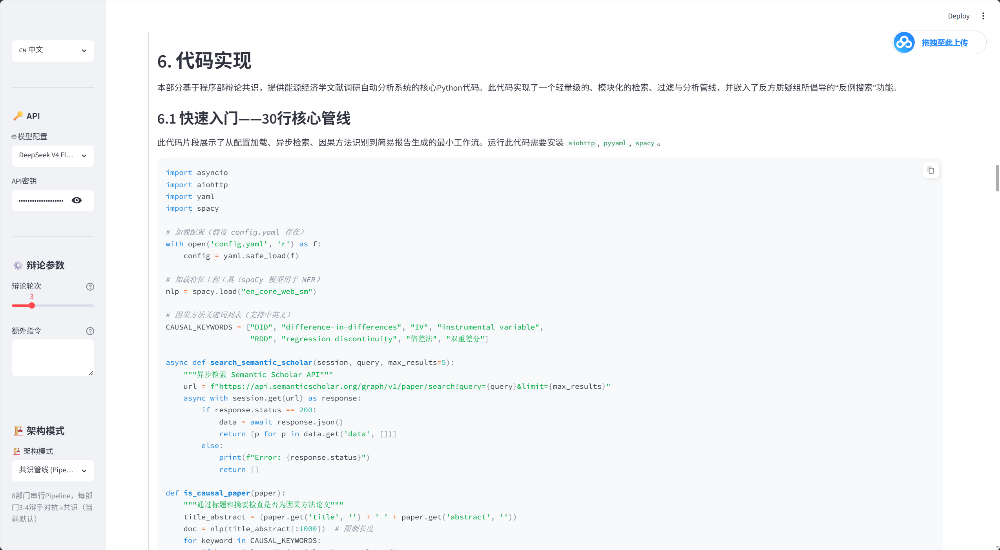
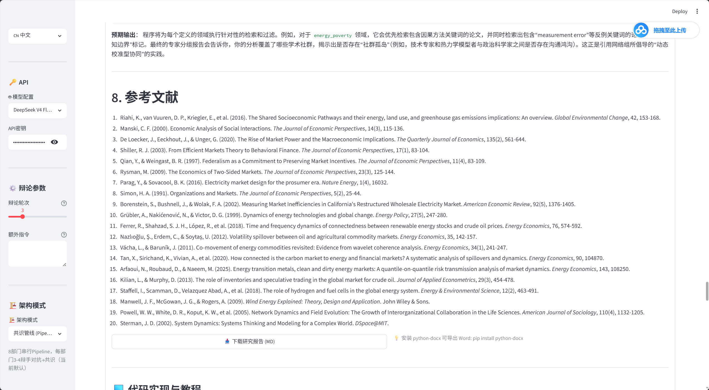

# 🧠 Consensus Pipeline 共识管线

<p align="center">
  
</p>

<p align="center">
  
  
  
</p>

> **多 Agent 辩论驱动的学术研究框架。**
> 不是单个 AI 替你写文献综述——是一支 AI 团队访谈你、辩论每条主张、达成共识、给每条结论标注置信度，并逐条校验引用与原文摘要的一致性。

📖 [English](README.md) · 📦 [GitHub Releases](https://github.com/fangqian616/consensus-pipeline/releases)

---

## ⚡ 快速上手（30 秒）

```bash
# 1) 一键安装（推荐）—— 自动 clone + 装依赖 + 打印 MCP 配置
#    Windows PowerShell：
irm https://github.com/fangqian616/consensus-pipeline/raw/main/install.ps1 | iex
#    macOS / Linux：
curl -fsSL https://github.com/fangqian616/consensus-pipeline/raw/main/install.sh | bash

# 2) …或自己跑 —— Streamlit 界面
git clone https://github.com/fangqian616/consensus-pipeline.git && cd consensus-pipeline
pip install -r requirements.txt
streamlit run app.py          # → http://localhost:8501

# 3) …或无头命令行（v2，推荐）
export DEEPSEEK_API_KEY="sk-your-key"   # Windows：$env:DEEPSEEK_API_KEY="..."
python run_pipeline_v2.py --topic "你的课题"
```

完整说明（DSH / MCP / CLI、全文上传、自定义端点）→ [📖 使用方式](#-使用方式)

---

## ❓ 为什么不直接问 ChatGPT？

单个 LLM 产出的答案听起来很自信，但没有交叉验证——幻觉混入其中，冲突视角被压平，你分不清哪些结论可靠、哪些是推测。

Consensus Pipeline 用**结构化多 Agent 辩论作为质量门控**替代一次性生成：每条主张都被独立"部门"挑战，矛盾被显式暴露，最终结论带有**置信度标注**（如"42/77 篇支撑，高置信度"）。

相当于自带同行评审——不是一个作者，而是一个对抗性委员会。

---

## 📸 效果展示

### 第一步：需求访谈
AI 智能体会先访谈你，了解研究范围、约束条件和目标。



### 第二步：智能部门配置
AI 根据你的主题自动生成 10+ 个专业辩论部门，每个部门配备多位辩手，从不同方法论角度展开辩论。



### 第三步：多轮辩论
实时观看辩手辩论。每轮辩手陈述立场、挑战他人假设、完善论证。每个部门默认运行 3-8 轮，收敛后提前停止（动态终止）。



### 第四步：结构化输出
辩论结果结构化输出为 JSON，清晰标注角色、立场和共识点，为报告生成做好准备。



### 第五步：带置信度标注的综述报告
最终报告包含逐条结论的置信度评分、方法论对比矩阵和已验证的引用文献。每条结论都标注支撑论文数量。

完整报告示例（148 篇论文，能源经济学方向）：见 `examples/final_report.md`

### 附加产出：自动生成代码与参考文献
管线还会生成可运行的 Python 代码和经过校验的参考文献列表。

<p float="left">
  
  
</p>

---

## 🎯 功能概述

Consensus Pipeline 输入一个研究主题，通过多 Agent 辩论产出结构化文献综述。

**一句话总结：** 检索论文 → 三层 QC 过滤 → 11 个部门辩论每条主张 → 跨部门交叉验证 → 生成带置信度评分的综述报告。

**与 Elicit/Consensus.app 的关键区别：** 那些工具是提取和总结，这个工具是**辩论**。每条结论在进入报告之前，必须经受多个 AI 智能体的对抗性质疑。

### 实际可用功能：
- ✅ 多源论文检索（OpenAlex + Semantic Scholar + arXiv）
- ✅ 三层 QC 过滤：硬过滤 → LLM 分类 → 重要性标注（219 → 77 篇，排除率 ~65%）
- ✅ 10-11 个辩论部门，每部门 2-4 位辩手从不同视角辩论
- ✅ 多轮辩论 + **动态终止**——表态量化（CV）+ Kendall's W 协调系数，辩手收敛即提前停，不再跑满固定轮次
- ✅ 跨部门交叉验证（部门之间互相检查结论）
- ✅ 逐条结论置信度标注（如"42/77 篇支撑，高置信度"）
- ✅ NLI 引用校验——逐条论断判定（✅/⚠️/❌），不可判条目（📖需查全文/📭仅标题）显式排除、不计入置信度
- ✅ 引用错位 vs 断言拔高区分——摘要和全文都中性时，校验器会告诉你*原因*：⚠️ 引用错位（论文不对）还是 ✂️ 断言拔高（措辞过强）
- ✅ 全文 NLI 升级——摘要中性的论断自动抓全文重验（Unpaywall/Semantic Scholar 的 OA 全文，或你上传的 PDF）
- ✅ 元叙述断言过滤——报告自我统计（"本综述纳入 215 篇"）被排除校验，不再污染置信度
- ✅ 部门间共识传递——后续部门看到前序部门结论（不再是孤岛式辩论）
- ✅ 转述忠实性约束——报告只转述论文明确写出的内容（不编造数据层级/机制方向）
- ✅ 全文补录系统——上传付费墙论文 PDF，辩论中断点询问"缺失但必要"的论文，导入后强制进报告
- ✅ 自动生成可运行的研究方法代码
- ✅ PDF/DOCX 导出
- ✅ 双语输出（`--lang en` 或 `--lang zh`）
- ✅ Streamlit 可视化界面，实时监控辩论进程 + 手动/自动收敛模式
- ✅ DSH 控制台面板——原子校验卡片、全文批量上传、一键重跑校验（带进度条）、待导入清单（暂停/继续/跳过）
- ✅ 一键安装脚本——`irm …install.ps1 | iex` / `curl …install.sh | bash`
- ✅ DSH 插件 bundle——`dsh plugin add`，首次自动 clone 项目
- ✅ 种子论文导入——你自己的 PDF 强制进辩论和报告

### 待改进：
- ⚠️ 部分 UI 标签在英文模式下仍有中英混合
- ⚠️ 跨部门配对逻辑较基础（两层回退，未优化）
- ⚠️ 完整运行需 10-30 分钟，API 费用约 $0.05-0.10

---

## 🏗️ 工作原理

| Phase | 阶段 | 说明 |
|-------|------|------|
| **0** | 需求调研 | AI 访谈你的研究范围、约束与目标 |
| **0.5** | 域配置生成 | AI 生成域配置（零硬编码） |
| **1** | 需求结构化 | 范围与约束提取 |
| **2** | 需求讨论 | 多角度需求讨论 |
| **3** | 配置推荐 | 部门配置推荐 |
| **3.5** | QC 质量门控 | 三层过滤：`hard_filter → LLM_classify → tag_layer` |
| **4** | 文献检索 | OpenAlex + Semantic Scholar + arXiv — 去重、摘要回填 |
| **4.9** | 全文抓取 | 自动抓取 OA 全文（Unpaywall → Semantic Scholar → OpenAlex） |
| **5** | 部门辩论（v2） | 11 个部门辩论；表态量化（CV）+ Kendall's W → 动态终止 |
| **5.5** | 全文补录断点 | 交互式断点——只导入缺失但必要的付费墙 PDF |
| **6** | 交叉辩论 | 部门之间互相验证结论 |
| **7** | 报告生成 | 综述报告 + 置信度标注 + 代码 + PDF/DOCX 导出 |
| **7.5** | 引用校验 | NLI 逐条核对论断与原文摘要/全文 |

### 11 个研究部门

| 部门 | 辩论内容 |
|------|---------|
| 文献检索 | 检索哪些数据库、用什么关键词、广度 vs 精度 |
| 元数据检查 | DOI 验证、元数据完整性、来源可靠性 |
| 引用网络 | 引用分析、影响力指标、影响力图谱 |
| 方法论评审 | 7 维度评估：准确度、效率、可解释性等 |
| 数据验证 | 数据源质量、可复现性、潜在偏差 |
| 反证部门 | 反主流发现、争议识别 |
| 主题聚类 | 主题分组、趋势检测、空白识别 |
| 可视化 | 图表分析、分布模式、数据呈现 |
| 报告整合 | 将各部门结论综合为最终结构化报告 |
| 编程 | 推荐工具/方法，生成可运行代码 |
| 教程 | 教授研究工具使用方法，提供方法论指导 |

### 置信度标注

报告中每条结论都带有置信度标签：

> 深度学习方法主导短期能源负荷预测 **（42/77 篇支撑，高置信度）**
>
> 图神经网络在能源网络优化中显示新兴潜力 **（3/77 篇支撑，低置信度——趋势未建立）**

不再有无支撑的断言。

### 引用校验报告（NLI）

报告生成后，独立校验器把**每条论断与检索到的原文摘要逐条比对**（自然语言推理）——没有任何论断免检出厂。

每条论断获得显式判定：
- ✅ **已验证**——摘要直接支撑该论断
- ⚠️ **部分验证**——仅部分内容被支撑
- ❌ **矛盾**——摘要与该论断相悖
- ❓ **未验证**——证据不足（计入置信度分母）

仅凭摘要**无法判定**的论断会被**诚实分桶，而非静默计入**：
- 📖 **需查全文**——摘要未覆盖该论断（不计入评分）
- 📭 **仅标题**——无摘要可用（不计入评分）

因此总体置信度只反映校验器真正可判的论断。校验时注入作者元数据，先确认*就是这篇论文*再判内容——抓住那些看起来像样的张冠李戴。

### 全文补录系统

付费墙论文是诚实的缺口：校验器只能凭摘要判断论断，而很多论断需要真正的全文。管线用两步补齐这个缺口：

1. **Phase 4.9——自动（零用户参与）。** 辩论前，管线自动爬取每篇检索论文的 OA 全文（Unpaywall → Semantic Scholar → OpenAlex），并匹配你放进 `fulltext_papers/` 的任何 PDF。
2. **Phase 5.5——交互式断点。** 前几个辩论部门跑完后，管线提取辩论*实际引用*的每篇论文，找出**既缺全文又必要**（共识引用或跨部门）的那几篇，只问你导入这几篇。
3. **全文 NLI 升级。** 摘要中性时，校验器抓全文重验：entail → ✅ 已验证；contradict → ❌ 矛盾；仍中性 → 分类为 ⚠️ **引用错位**（论文不对）或 ✂️ **断言拔高**（论文对但措辞过强）。
4. **强制进报告。** 你导入的论文标记 `weight=core`，保证进报告——上传不白费。

上传 PDF 的两种方式：
- **DSH 控制台面板**——批量上传（文件名随便，DOI 自动从 PDF 内部提取），然后一键重跑校验
- **直接拖进 `fulltext_papers/`**，然后跑 `--rerun-67` 只重跑报告+校验阶段

### QC 审校部门（三层过滤）

最大的质量关口。三层过滤确保零污染：
- **第一层——硬过滤**：通过 LLM 生成的排除信号直接剔除明显不相关论文
- **第二层——LLM 分类**：LLM 逐篇判定论文的领域归属
- **第三层——重要性标注**：将论文分为 core / method / background 三级

能源经济学实测：219 → 77 篇，排除率 64.8%。

### 动态领域配置

零硬编码关键词。LLM 根据你的主题生成一切——排除信号、搜索词轮换、分级定义。从"能源经济学中的 ML"换到"医疗中的 LLM"？零代码改动。

---

## 📖 使用方式

三种运行方式，任选其一：

| 入口 | 适合 |
|------|------|
| **🚀 一键安装脚本** | 最快上手——一条命令完成 clone + 装依赖 + 输出配置 |
| **🤖 DSH / MCP（AI agent）** | 让 AI agent 从聊天里驱动（DeepSeek Harness、Claude、Cursor…） |
| **🖥️ Streamlit / 命令行（手动）** | 自己本地跑，实时看辩论、可脚本化 |

---

### 🚀 方式一：一键安装脚本（推荐）

发对方一条命令，自动装好。不用分步 clone / pip / 配置。

**Windows（PowerShell）：**

```powershell
irm https://github.com/fangqian616/consensus-pipeline/raw/main/install.ps1 | iex
```

**macOS / Linux：**

```bash
curl -fsSL https://github.com/fangqian616/consensus-pipeline/raw/main/install.sh | bash
```

脚本会自动：`git clone` → `pip install -r requirements.txt` → 打印 MCP 客户端的 `mcp.json` 配置片段。

然后把打印的片段粘进你的 MCP 客户端（`mcpServers.consensus-pipeline` → `python mcp_server.py`）。支持 Claude Desktop、Cursor、Codex 及任何 MCP 兼容 agent。

> 💡 需要 `git` 和 `python3.10+`。首次 `pip install` 约 1-2 分钟。

---

### 🤖 方式二：AI Agent（DSH / MCP）

#### DSH（DeepSeek Harness）——原生工具 + 控制台面板

以 bundle 形式安装（自动注册原生工具 + 挂载 `/consensus-pipeline/` 面板）：

```bash
git clone --depth 1 https://github.com/fangqian616/consensus-pipeline.git
npx -p @deepseek-ai/dsh dsh plugin --profile web add file:./consensus-pipeline/dsh-plugin
```

本地开发则把插件目录链接进 DSH 的 `node_modules` 后重启。

首次使用时插件会自动 clone 完整项目到 `~/.dsh/consensus-pipeline`（保证 Python `mcp_server.py` 始终存在，无需手动 clone）。右下角出现 **📊 控制台** 浮动按钮。

**日常使用：**

1. 在聊天里对 agent 说出研究方向 → agent 先做需求访谈，然后启动管线。
2. 点 **📊 控制台** 打开面板——实时进度、原子校验、全文上传。
3. Phase 5.5 断点出现 **⏳ 待导入清单**：暂停、拖入付费墙 PDF、继续。

#### 任意 MCP 客户端（Claude Desktop / Cursor / Codex…）

MCP 服务器零依赖（纯标准库）。任何 MCP 客户端指向它即可：

```json
{
  "mcpServers": {
    "consensus-pipeline": {
      "command": "python",
      "args": ["/path/to/consensus-pipeline/mcp_server.py"]
    }
  }
}
```

上面的一键安装脚本会直接帮你打印这段配置。

---

### 🖥️ 方式三：Streamlit / 命令行（手动）

自己本地跑——可视化界面或无头脚本。

#### Streamlit 网页界面

```bash
git clone https://github.com/fangqian616/consensus-pipeline.git
cd consensus-pipeline
pip install -r requirements.txt
streamlit run app.py
```

浏览器打开 `http://localhost:8501`。在侧边栏粘贴 DeepSeek API Key、选择语言，然后启动学术管线——AI 访谈员会先问清你的课题，自动生成辩论部门，接着多轮辩论实时运行。

#### 命令行（无头）

```bash
git clone https://github.com/fangqian616/consensus-pipeline.git
cd consensus-pipeline
pip install -r requirements.txt
```

设置 API Key：

```bash
# Linux/macOS
export DEEPSEEK_API_KEY="sk-your-key-here"
# Windows（PowerShell）
$env:DEEPSEEK_API_KEY="sk-your-key-here"
# …或在项目根目录创建 .env：DEEPSEEK_API_KEY=sk-your-key-here
```

运行 **v2 管线**（推荐——表态量化 + 动态终止）：

```bash
python run_pipeline_v2.py --topic "Machine Learning in Energy Economics" --lang en
# 中文（默认）
python run_pipeline_v2.py --topic "碳市场价格预测与能源转型关联机制研究"
```

可选先做需求调研（Phase 0-3 → 工作组配置）：

```bash
python run_requirement_research.py --topic "你的课题"
```

补全文后只重跑报告+校验阶段：

```bash
python run_pipeline_v2.py --topic "你的课题" --output-dir "v2_run_output/<运行目录>" --rerun-67
```

输出落在 `v2_run_output/<日期>_<课题>/`（v2）或 `run_output/`（v1）——Markdown + DOCX 报告、`citation_verification.json`、辩论日志和生成的图表。

#### 全文补录（付费墙论文）

付费墙论文无法仅凭摘要校验。两种方式补齐：

- **DSH 控制台面板**——批量上传付费墙 PDF（文件名随便，DOI 自动提取），一键重跑校验（带进度条），待导入清单支持暂停/继续/跳过。
- **CLI `--rerun-67`**——把 PDF 拖进 `fulltext_papers/`，然后只重跑报告+校验阶段（复用已完成的辩论）。

#### 自定义 API 端点（可选）

任何 OpenAI 兼容 API 均可：

```bash
export DEEPSEEK_API_KEY="your-key"
export DEEPSEEK_MODEL="deepseek-v4-flash"   # 或 deepseek-v4-pro
python run_pipeline_v2.py --topic "你的主题" --lang zh
```

---

## 📋 前提条件

| 要求 | 说明 |
|------|------|
| Python 3.10+ | 推荐 3.11+ |
| DeepSeek API Key | [注册](https://platform.deepseek.com/) — 每次完整运行约 $0.05-0.10 |
| git | 一键安装脚本 / clone 需要 |
| 网络 | 需访问 DeepSeek API（支持自定义端点） |

> 💡 不需要 GPU，不需要数据库。论文检索使用免费开放 API（arXiv / Semantic Scholar / OpenAlex）。

---

## ⚙️ 配置

### API 密钥

| 变量 | 必需 | 说明 |
|------|------|------|
| `DEEPSEEK_API_KEY` | ✅ 是 | LLM 调用的 API 密钥 |
| `EASYSCHOLAR_SECRET_KEY` | 否 | 增强期刊排名（可选，默认使用 209 期刊本地注册表） |

### 支持的模型

| 服务商 | API 地址 | 已测试 |
|--------|---------|--------|
| DeepSeek | `https://api.deepseek.com/v1` | `deepseek-v4-flash`（辩论）、`deepseek-v4-pro`（校验/报告） |
| OpenAI | `https://api.openai.com/v1` | `gpt-4o`（兼容） |
| 自定义 | 任意 OpenAI 兼容端点 | 任意模型 |

在 Streamlit 侧边栏或环境变量中设置 API 密钥和模型。

---

## 📁 项目结构

```
consensus-pipeline/
├── install.ps1 / install.sh     # 一键安装脚本（clone + pip + mcp.json）
├── app.py                       # Streamlit 主界面
├── router.py                    # AI Router — 智能部门配置
├── debate_engine.py             # 核心辩论引擎
├── config_manager.py            # 配置持久化与预设
├── run_pipeline.py              # CLI 运行器（v1）
├── run_pipeline_v2.py           # CLI 运行器（v2）——表态量化 + 动态终止
├── stance_quant_v2.py           # v2 表态量化（CV + Kendall's W 收敛）
├── run_requirement_research.py  # 需求调研（Phase 0-3）
├── paper_importer.py            # 种子论文导入（PDF → 元数据）
├── consensus_meter.py           # 共识度仪表盘
├── mcp_server.py                # MCP 服务器（零依赖）
├── panel.html                   # DSH 控制台面板（校验卡片 + 全文上传）
├── dsh-plugin/                  # DSH 插件 bundle（挂载 /consensus-pipeline/ + 原生工具）
│   ├── index.js                 #   面板路由 + JSON-RPC 工具 + 自动 clone
│   └── cordis.patch.yml         #   bundle patch
├── fulltext_papers/             # 用户上传的付费墙论文 PDF（gitignore）
├── quality_controller.py        # QC 审校部门（三层过滤）
├── domain_config_generator.py   # 动态领域配置
├── docx_exporter.py             # Word 导出
├── pdf_exporter.py              # PDF 导出
├── academic/                    # 学术研究模块
│   ├── search_engine.py         # 多源论文检索
│   ├── journal_classifier.py   # 期刊质量筛
│   ├── journal_registry.py     # 209 期刊本地注册表
│   ├── cross_validator.py       # 交叉验证与主题聚类
│   ├── report_generator.py      # 带置信度的报告生成
│   ├── report_visualizer.py     # 报告图表
│   └── visualizer.py            # 学术图表（趋势、分布）
├── requirement/                 # 需求与校验模块
│   ├── interviewer.py           # AI 访谈智能体
│   ├── structurer.py            # 范围与约束提取
│   ├── discussion_group.py      # 多角度需求讨论
│   ├── config_recommender.py    # 部门配置推荐
│   ├── citation_verifier.py     # NLI 引用校验
│   └── fact_checker.py          # 关键结论事实核查
├── templates/                   # 辩论提示词模板
├── presets/                     # 内置预设
├── docs/                        # 快速上手与预设指南
├── examples/                    # 截图与示例输出
└── user_profiles/               # 访谈档案
```

---

## 🗺️ 版本历史

| 版本 | 日期 | 变更 |
|------|------|------|
| **v0.12.18** | 2026-07-30 | NLI 逐条引用校验报告（✅/⚠️/❌ 判定，📖/📭 不可判条目显式排除不计分）、作者元数据注入、Streamlit Cloud 在线版上线 |
| v0.8 ~ v0.12.17 | 2026-07-22~29 | 校验体系多轮迭代加固（版本探针、断点恢复、互斥分层等），详见 commit 历史 |
| **v0.7.8** | 2026-07-21 | 修复中英文语言输出对称性（9 处英文 + 13 处中文强制指令）、最终报告语言泄漏修复、双语全链路测试通过 |
| **v0.7.7** | 2026-07-20 | 回退 daemon 线程方案为同步执行，修复辩论中断 bug |
| **v0.7.5** | 2026-07-17 | UI 9→4 Tab 重组、easyScholar 降级、README 全面重写、语言选择前置 |
| **v0.7.3** | 2026-07-17 | 修复辩论轮次参数处理（多轮辩论循环） |
| **v0.7.2** | 2026-07-17 | 英文报告输出（`--lang en`）、GitHub 旧 tag 清理 |
| **v0.7.1** | 2026-07-17 | 首个开源版本：QC 审校部门、动态领域配置、引用校验、置信度标注、OpenAlex 优先 |

> v0.7.1 之前的版本为内部开发版，未公开发布。

---

## 🗺️ 路线图

| 优先级 | 功能 | 状态 |
|--------|------|------|
| P0 | 修复英文模式 UI 标签中英混合 | 进行中 |
| P1 | 语义引用校验 | ✅ 已上线（NLI 方案，v0.12） |
| P1 | 子主题 query 拆分 | 规划中 |
| P1 | 发表偏倚检测（漏斗图） | 规划中 |
| P2 | 跨语言检索（知网 + 双语对齐） | 规划中 |
| P2 | 增量更新能力 | 规划中 |
| P2 | 辩论质量评估指标 | 规划中 |

---

## ❓ 常见问题

**Q: 完整运行需要多长时间？**
A: 10-30 分钟，取决于主题和论文数量。辩论阶段是瓶颈——部门越多，API 调用越多。

**Q: 费用多少？**
A: 以 DeepSeek 定价，一次完整运行（148 篇论文、11 个部门、每部门 3-8 轮）约 $0.05-0.10。

**Q: 支持哪些模型？**
A: 任何 OpenAI 兼容 API。主力测试使用 DeepSeek。理论上支持本地模型（通过自定义端点），尚未充分测试。

**Q: 输出支持哪些语言？**
A: 学术管线：中文（`--lang zh`，默认）和英文（`--lang en`）。Streamlit 界面支持中英文。

**Q: 可以自定义部门吗？**
A: 可以。AI 根据你的主题自动生成部门，你可以在 Streamlit 界面中编辑、添加或删除部门后再启动辩论。

**Q: 和 Elicit 或 Consensus.app 有什么区别？**
A: 那些工具是提取和总结。这个工具是**辩论**——每条结论在进入报告之前，必须经受多个 AI 智能体的对抗性质疑。代价是更慢、更贵，但能发现单次摘要遗漏的矛盾。

**Q: 辩论真的有用吗？**
A: 有用，而且很明显。我们跑了对比测试：不开辩论，报告只是总结论文声称的内容。开辩论后，不同视角的智能体互相挑战——这些挑战会进入最终报告。例如，"准确度"部门报告分解方法可降低 10-40% 误差，"方法论严谨性"部门则指出这些论文普遍存在数据泄漏。两个视角都出现在最终报告中。不开辩论，只有准确度那条会留下来。目前还无法量化整体报告质量提升了多少——评估指标正在开发中。

---

## 🤝 贡献

欢迎 PR！特别需要：
- 🐛 Bug 修复
- 📝 文档改进
- 🎭 新辩手视角
- 📊 多 Agent 辩论质量的评估基准

---

## 📄 许可证

MIT License

---

> 这是一个学生项目，正在积极开发和测试中。欢迎反馈、Bug 报告和建议。

---

如果这个项目对你有帮助，欢迎点个 ⭐——这能让更多人看到它。

